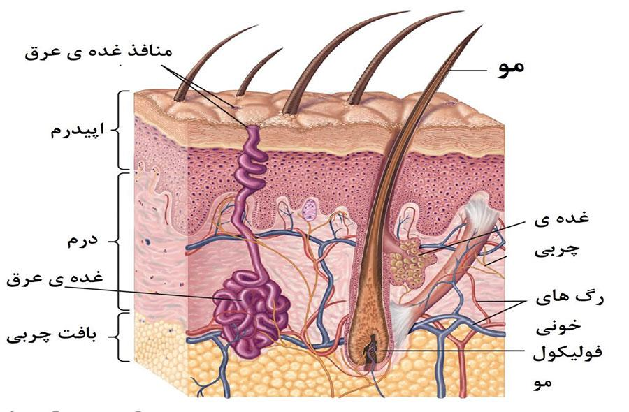
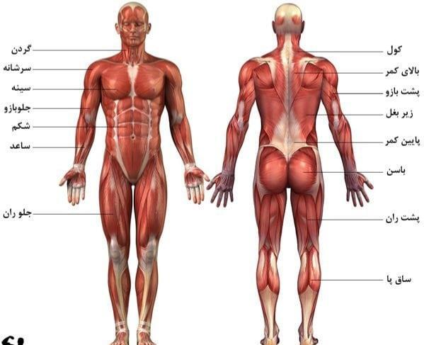

[بازگشت به خانه](index.md)

**[برای مطالعه خلاصه کوتاه‌تر اینجا لینک کلیک کنید.](salamat-shakari2.md)**

## فهرست مطالب

- [بخش 1 - درس 1](#1-1)
- [بخش 1 - درس 2](#1-2)
- [بخش 1 - درس 3](#1-3)
- [بخش 1 - درس 4](#1-4)
- [بخش 1 - درس 5](#1-5)
- [بخش 1 - درس 6](#1-6)
- [بخش 1 - درس 7](#1-7)
- [بخش 1 - درس 8](#1-8)
- [بخش 2 - درس 2](#2-2)
- [بخش 2 - درس 3](#2-3)
- [بخش 2 - درس 4](#2-4)
- [بخش 2 - درس 5](#2-5)
- [پیوست‌ها](#پیوست-ها)

# 1-1
### مفاهیم و تعاریف بهداشت و شاخص‌های بهداشتی

---

**مقدمه**

از دیرباز، یکی از مهم‌ترین دغدغه‌های بشر حفظ سلامتی و رهایی از درد و رنج بیماری‌ها بوده است. در گذشته به دلیل عدم آگاهی مردم از چگونگی وقوع بیماری‌ها، شیوع امراض مختلف منجر به ناتوانی و مرگ و میر زیادی می‌شد. با پیشرفت علم، بشر آموخت که باید در محیطی پاکیزه و سالم زندگی کند، از عوامل خطر دوری کند، افراد بیمار را درمان کند و افراد سالم را در برابر بیماری‌ها مقاوم سازد. تحقیقات نشان می‌دهد که پیشگیری از بیماری‌ها ارزان‌تر، آسان‌تر و کم‌خطرتر از درمان آن‌هاست. بنابراین، آگاهی از اصول بهداشتی و روش‌های پیشگیری برای داشتن یک زندگی آسوده جسمی، روانی و اجتماعی ضروری است.

**فرهنگ جامعه و بهداشت**

فرهنگ، محتوای روابط اجتماعی را شکل می‌دهد و الگوهای رفتاری خاصی را به افراد دیکته می‌کند. این الگوها شامل زبان، گرایش‌ها، مهارت‌ها و نظام‌های ارزشی هستند. آداب و رسوم مربوط به حفظ تندرستی، تشخیص بیمار و نحوه مراقبت از او نیز از طریق فرهنگ تعیین می‌شوند. با این حال، عوامل فرهنگی می‌توانند در پذیرش روش‌های جدید پیشگیری و درمان نیز مشکلاتی ایجاد کنند. تغییرات سریع فرهنگی می‌تواند نهادهای اجتماعی اولیه مانند خانواده، مدرسه و مذهب را دستخوش دگرگونی کند که این امر رفاه و تندرستی جامعه را به خطر می‌اندازد. علت‌شناسی بیماری‌ها در فرهنگ‌های مختلف متفاوت است و پاسخ‌های افراد به این سؤال (علت بیماری چیست؟) می‌تواند خرافی، مذهبی یا علمی باشد.

**نهادهای اجتماعی مؤثر بر بهداشت**

دو نهاد اصلی که بر تندرستی و بهداشت تأثیر می‌گذارند عبارتند از:

- **خانواده:** یکی از مهم‌ترین نهادهای اجتماعی است که عواملی مانند محل سکونت، طبقه اجتماعی، سطح فرهنگ و روابط خانوادگی در آن با بهداشت و بیماری ارتباط دارند.

- **آموزش و پرورش:** مدارس وظیفه دارند به کودکان آموزش دهند که چگونه با محیط اطراف خود رفتار کنند، خود را در برابر خطرات بهداشتی حفظ کنند، در رفاه جامعه مشارکت داشته باشند و به بیماران و افراد معلول کمک کنند.

---

### مفاهیم و تعاریف کلی بهداشت

---

تعریف بهداشت در طول زمان و با پیشرفت‌های اقتصادی، پزشکی و اجتماعی تغییر کرده است. بسیاری از مردم بهداشت را به معنی عدم ابتلا به بیماری می‌دانند، اما این تعریف جامع نیست. این تعریف تنها به سلامت جسمانی اشاره دارد و سلامت روانی و اجتماعی را در نظر نمی‌گیرد. برای مثال، فردی که از نظر جسمی سالم است اما از نظر روانی در اضطراب به سر می‌برد یا در جامعه‌ای با نرخ بالای مرگ و میر و اعتیاد زندگی می‌کند، نمی‌تواند کاملاً سالم تلقی شود.

**تعریف سازمان بهداشت جهانی**

بر اساس تعریف سازمان بهداشت جهانی (WHO)، بهداشت یک

**حالت کامل سلامتی جسمی، روانی و اجتماعی است** و صرفاً به معنی عدم ابتلا به بیماری یا ناتوانی نیست. عوامل ارثی، شخصی و محیطی نیز بر سلامتی افراد تأثیرگذار هستند و زندگی یک فرد سالم در محیط نامناسب می‌تواند باعث بیماری شود.

---

### اهمیت آموزش بهداشت

---

آموزش بهداشت یک مفهوم جدید نیست و از ابتدای اجتماعی شدن انسان‌ها وجود داشته است. حتی فیلسوفانی مانند افلاطون و ارسطو نیز بر اهمیت آن تأکید داشتند و معتقد بودند که هر شهر باید مأموری برای آشنا کردن مردم با اصول بهداشت داشته باشد. با وجود اینکه آموزش بهداشت یک رشته قدیمی است، اما گستردگی امروزی را نداشته و تجربه علمی آن از سال ۱۹۲۰ به بعد افزایش یافته است. امروزه، آموزش بهداشت در ردیف مهم‌ترین دانش‌های عصر قرار گرفته است، به طوری که پروفسور وینسلو، زیست‌شناس آمریکایی، آن را کمتر از شناخت میکروب‌ها در تشخیص و درمان بیماری‌ها نمی‌داند.

**نقش آموزش بهداشت در جامعه**

- اقدامات بهداشتی بدون آموزش بهداشت نتیجه مثبتی نخواهند داشت.

- آموزش بهداشت در مردم علاقه به زندگی سالم‌تر را ایجاد می‌کند و اقدامات بهداشتی را پایدار و دائمی می‌سازد.

- آموزش بهداشت مجموعه‌ای از تجربیات است که بر اطلاعات، طرز تفکر و رفتار فردی و اجتماعی افراد تأثیر می‌گذارد و موجب سلامت جسمی و روانی آن‌ها می‌شود.

- هر برنامه اصلاحی بدون آموزش به نتیجه مثبت نخواهد رسید و به تدریج از بین خواهد رفت.

---

### اهداف آموزش بهداشت

---

آموزش بهداشت در هر جامعه‌ای اهداف مختلفی را دنبال می‌کند:

- **اهداف اجتماعی:** فردی که آموزش بهداشت دیده، نسبت به مسائل بهداشتی خود و جامعه‌اش درک صحیح پیدا می‌کند و در برابر روندهای ضدبهداشتی مقاومت می‌کند. همچنین، دیگران را به درک نیازهای بهداشتی راهنمایی کرده و در انتقال آموزش‌ها به جامعه مشارکت می‌کند. اجرای قوانین بهداشتی و حمایت از سازمان‌های بهداشتی باعث بهبود عادات بهداشتی جامعه و تضمین حیات اجتماعی می‌شود.

- **اهداف اقتصادی:** سلامت نیروی انسانی یک کشور باعث افزایش امکان سرمایه‌گذاری و برنامه‌ریزی‌های اصولی می‌شود. آموزش بهداشت باعث می‌شود افراد در مصرف مواد و منابع صرفه‌جویی کنند و از سرمایه‌ها به خوبی محافظت نمایند. این امر هزینه‌های سنگین درمانی را کاهش می‌دهد و به افراد امکان می‌دهد زندگی‌ای سرشار از لذت داشته باشند.

- **اهداف دفاعی:** جامعه‌ای که در آن اصول بهداشتی رعایت می‌شود، آمادگی و قابلیت بیشتری در برابر نیروهای بیگانه دارد. در مقابل، اگر افراد به دلیل عدم رعایت بهداشت گرفتار بیماری شوند، توان مقاومت و مقابله خود را از دست داده و بنیه نیروی انسانی کشور ضعیف می‌شود که این امر زمینه را برای تجاوز بیگانگان فراهم می‌کند.

---

### ارزشیابی بهداشت در انسان

---

قضاوت مردم درباره ما اغلب بر اساس ظاهر ماست، بنابراین توجه به آراستگی ظاهری مهم است. آراستگی به عواملی مانند درست ایستادن، تمیزی لباس، پاکیزگی پوست، مو و دندان‌ها بستگی دارد. بی توجهی به این موارد می‌تواند منجر به بیماری‌های مختلف و دوری مردم از ما شود. بسیاری از افراد تا زمانی که سالم هستند به سلامتی خود توجهی ندارند و تنها زمانی که بیمار می‌شوند به ارزش واقعی آن پی می‌برند. در مقابل، افرادی که به بهداشت خود اهمیت می‌دهند، کارایی بیشتری داشته و با رفتاری پسندیده و شاد با دیگران معاشرت می‌کنند.

برای برخورداری از بهداشت خوب، هر فرد باید به نکات زیر توجه کند:

- نظافت و بهداشت اعضای بدن

- تغذیه و بهداشت مواد غذایی

- خواب و استراحت

- ورزش و تفریح

- عدم اعتیاد به مواد مخدر، محرکات و فضاهای مجازی

- مراقبت‌های پزشکی

- فلسفه زندگی مربوط به خود و دیگران

علاوه بر این موارد، مسائل بهداشتی محیط زیست نیز باید تأمین شود تا رفاه جسمی، روانی و اجتماعی انسان فراهم آید. این اقدامات که معمولاً توسط دولت انجام می‌شود، شامل موارد زیر است:

- بهداشت هوا

- تأمین آب آشامیدنی سالم

- دفع بهداشتی فاضلاب و زباله

- پیشگیری و کنترل بیماری‌های واگیر و مزمن

- ارائه خدمات درمانی مطلوب

- پیشگیری از سوانح و حوادث

- بهداشت مسکن و بهداشت صنعتی

- کنترل آلودگی‌های صوتی، شیمیایی و هسته‌ای خاک

---

### شاخص‌های بهداشتی

---

برای ارزیابی وضعیت بهداشتی یک جامعه، از شاخص‌های عددی استفاده می‌شود. شاخص‌ها اعداد یا نسبت‌هایی هستند که وضعیت بهداشتی را در زمان معین نشان می‌دهند و برای مقایسه وضعیت‌ها به کار می‌روند. مهم‌ترین شاخص‌های بهداشتی برای ارزیابی سلامت جامعه عبارتند از:

- **امید به زندگی:** تعداد سال‌هایی است که افراد یک جامعه انتظار دارند زنده بمانند. این شاخص یک معیار مثبت برای تندرستی است و هرچه وضعیت بهداشت بهتر باشد، امید به زندگی بالاتر است.

- **میزان مرگ و میر خام:** تعداد مرگ و میر در یک سال در کل جمعیت است و با فرمول (تعداد مرگ و میر در یک سال / جمعیت در اواسط سال) * 1000 محاسبه می‌شود.

- **میزان مرگ و میر کودکان (کمتر از یک سال):** تعداد مرگ و میر کودکان زیر یک سال در یک سال خاص است و با فرمول (تعداد مرگ و میر کودکان زیر یک سال / تعداد نوزادانی که در آن سال به دنیا آمده‌اند) * 1000 محاسبه می‌شود. این شاخص بسیار مهم و معرف وضعیت یک جامعه است. هرچه میزان مرگ و میر کودکان در یک جامعه کمتر باشد، برنامه‌های بهداشتی آن موفق‌تر بوده‌اند.

- **میزان رشد طبیعی جمعیت:** تعداد افراد اضافه شده به جمعیت در یک سال را نشان می‌دهد و با فرمول (تفاضل تعداد مرگ‌ها از موالید در یک سال / جمعیت در اواسط سال) * 1000 محاسبه می‌شود.

**نکات تکمیلی در مورد شاخص‌ها** علاوه بر شاخص‌های ذکرشده، شاخص‌های دیگری مانند فقر، جرائم، بهداشت مسکن، اعتیاد، سواد و... نیز می‌توانند برای ارزیابی وضعیت بهداشتی جامعه استفاده شوند. هرچه تعداد این معضلات در یک کشور بیشتر باشد، سطح بهداشت پایین‌تر است. از آنجا که وضعیت بهداشت یک جامعه ثابت نیست و با گذشت زمان تغییر می‌کند، شاخص‌ها نیز با تغییر وضعیت بهداشت تغییر می‌یابند. برای مثال، در کشورهای پیشرفته، علت اصلی مرگ و میر از بیماری‌های عفونی به بیماری‌های قلبی، سرطان و حوادث تغییر کرده است. برای ارزیابی دقیق‌تر وضعیت بهداشتی، باید از مجموعه‌ای از شاخص‌ها استفاده کرد. تعیین این شاخص‌ها باید بر اساس اصول استاندارد صورت گیرد تا قابل مقایسه و قابل فهم باشند

# 1-2

### **اهمیت سلامتی و بهداشت در اسلام**

اسلام برای انسان ارزش بسیار زیادی قائل است و او را موجودی شریف و قابل احترام می‌داند. هدف از این ارزش‌گذاری، فراهم کردن شرایطی است که انسان بتواند سلامت خود را حفظ کند و از بیماری‌ها مصون بماند تا راه برای رسیدن به کمال و مقصد اصلی حیات برای او فراهم شود. پیامبر اسلام فرموده‌اند: «رضایت پروردگار، شادمانی فرشتگان و استحکام سنت، برای بدنی است که سالم باشد». از نظر اسلام، انسانی که رنجور و بیمار است و برای خود و دیگران سودی ندارد، مورد پسند نیست. خدا و رسول (ص) مسلمانی را دوست دارند که ظاهری آراسته و باطنی پاکیزه داشته باشد. در قرآن کریم آمده است: «همانا خدا توبه‌کاران و پاکیزگان را دوست دارد».

اسلام تا حدی به سلامت اهمیت می‌دهد که نجات جان یک انسان را برابر با نجات جان تمام انسان‌ها می‌داند و هلاکت یک انسان را به منزله هلاکت تمامی انسان‌ها اعلام کرده است. اسلام پیروان خود را به کسب دانش در سراسر جهان تشویق می‌کند و با بیان این اصل کلی که «هر دردی درمانی دارد»، انگیزه تحقیق و امید به زندگی را در میان آن‌ها افزایش می‌دهد.

---

### **پیشگیری رفتاری در اسلام**

پیشگیری رفتاری یکی از اصول ریشه‌دار و موفق ایدئولوژی اسلامی است که در زمان پیامبر (ص) نیز به طور عملی اجرا شد. برای مثال، پیامبر (ص) برای حل مشکل اعتیاد به الکل در میان مردم عربستان، از یک روش تدریجی و چندمرحله‌ای استفاده کردند.

1. **مرحله اول**: ابتدا با تأکید بر فلسفه نماز به عنوان عاملی برای جلوگیری از گناه و فحشا ، مردم را به عبادت و راز و نیاز با خدا تشویق کردند. وقتی این امر محقق شد، فرمان داده شد که «در حالت مستی به نماز نایستید تا زمانی که بدانید چه می‌گویید». این دستور باعث شد مسلمانان اهل نماز، چندین بار در روز از نوشیدن الکل خودداری کنند و رفتار خود را به تدریج تعدیل کنند.

2. **مرحله دوم**: پس از مدتی که زمینه آماده شد، پیامبر (ص) فرمان به اجتناب مطلق از شراب‌خواری را صادر کردند. با نزول این آیه، مردم داوطلبانه و آشکارا خمره‌های شراب خود را از بین بردند.

این مثال نشان می‌دهد که پیشگیری رفتاری در اسلام زمانی موفق است که به تمام ابعاد یک رفتار ناسازگار توجه شود.

---

### **دستورالعمل‌های بهداشتی در اسلام**

دستورات بهداشتی اسلام شامل جنبه‌های مختلفی از زندگی روزمره می‌شود:

- **نظافت و پاکیزگی**: پیامبر اسلام (ص) نظافت را از نشانه‌های ایمان می‌دانستند. مسلمانان موظفند برای نماز پنج‌گانه، بدن و لباس خود را تمیز کنند. وضو گرفتن نیز به طور غیرمستقیم باعث می‌شود مسلمانان به طور مستمر به نظافت عادت کنند.

- **آب**: پاکیزگی آب برای وضو و طهارت بسیار مهم است و آب باید به قدری تمیز باشد که بتوان از آن نوشید.

- **خوردن و آشامیدن**: دستورات زیادی در این زمینه وجود دارد که علاوه بر جنبه‌های اخلاقی و اجتماعی، به جنبه‌های بهداشتی نیز توجه دارد.

 - **موارد حرام**: خوردن و آشامیدن هر چیزی که ضرر دارد یا نجس است، مانند الکل، گوشت خوک، گوشت حیوانات مرده یا درنده، حرام است. این ممنوعیت‌ها از ابتلا به بیماری‌ها و مسمومیت غذایی جلوگیری می‌کند. همچنین، مصرف گوشت حیوانات درنده روحیه درندگی و قساوت قلب را در انسان تقویت می‌کند.

 - **موارد مستحب (توصیه شده)**: شستن دست‌ها قبل و بعد از غذا، شستن میوه، مصرف مقداری نمک قبل و بعد از غذا، خوب جویدن غذا، تمیز کردن دندان‌ها، و دست کشیدن از غذا قبل از سیری کامل از جمله این توصیه‌ها هستند.

- **لباس پوشیدن**: توصیه‌هایی در مورد پاکیزگی و جنس لباس وجود دارد. پوشیدن لباسی که از پوست حیوان مرده تهیه شده، حرام است زیرا می‌تواند ناقل میکروب باشد. استفاده از لباس‌های طبیعی مانند پنبه و کتان به جای مواد مصنوعی توصیه می‌شود. همچنین، پوشیدن لباس سفید بهتر از لباس سیاه است، زیرا آلودگی را زودتر نشان می‌دهد و باعث رعایت بیشتر نظافت می‌شود.

- **خواب و استراحت**: آداب مفیدی در مورد خواب و استراحت در منابع اسلامی ذکر شده است. توصیه‌هایی مانند سحرخیزی، وضو گرفتن قبل از خواب، اجتناب از خواب زیاد هنگام طلوع و غروب آفتاب، و نخوابیدن با شکم پر یا دست‌های آلوده، همگی از نظر بهداشت و سلامت اهمیت دارند.

- **ختنه**: ختنه در اسلام واجب شمرده شده و به عنوان یک عمل بهداشتی که از تعالیم الهی نشأت گرفته، شناخته می‌شود. این عمل برای جلوگیری از بیماری‌های مقاربتی و برخی سرطان‌ها مفید است.

---

### **اصول و مبانی بهداشت اسلامی**

متن بهداشت اسلامی را بر اساس چندین اصل و مبنا خلاصه می‌کند:

1. **رایگان بودن**: دستورات بهداشتی اسلام رایگان و بدون هزینه در اختیار بشر قرار گرفته است.

2. **سهولت آموزشی**: اصل «امر به معروف و نهی از منکر» و «وجوب دانش‌اندوزی» مسلمانان را تشویق می‌کند تا دانش بهداشتی خود را به دیگران آموزش دهند.

3. **سهولت اجرایی**: این دستورات به راحتی در زندگی روزمره قابل اجرا هستند.

4. **تضمین شده بودن**: دستورات بهداشتی اسلام پشتوانه الهی دارند و در قلب مؤمنان جای می‌گیرند، بنابراین ضمانت اجرایی دارند.

5. **هدف‌دار بودن**: هدف بهداشت اسلامی، ایجاد جامعه‌ای سالم و انسان‌هایی است که هم از سلامت روانی و هم از بهداشت جسمی برخوردار باشند تا بتوانند به کمال نهایی برسند.

6. **وسعت دید**: بهداشت اسلامی جلوتر از زمان خود است و پیش از بروز مشکلات، پیشگیری‌های لازم را ارائه می‌دهد.

7. **در خدمت فطرت انسانی**: این دستورات بر اساس فطرت الهی انسان‌ها هستند و آن‌ها را به استفاده از مواهب طبیعی و پاکیزه تشویق می‌کنند.

8. **اقتصاد و صرفه‌جویی**: بهداشت اسلامی با صرفه‌ترین و پرسودترین نوع بهداشت است و از اتلاف قدرت حیاتی بدن جلوگیری می‌کند.

9. **اعتدال**: اصل اعتدال در تمام دستورات اسلامی، به ویژه در بهداشت، مورد تأکید قرار گرفته و از افراط و تفریط جلوگیری می‌شود.

10. **جهانی بودن**: این دستورات برای تمام زمان‌ها و مکان‌ها قابل استفاده است.

11. **تکامل‌گرایی**: اسلام از علم، عقل و تجربه برای تکمیل آموزه‌های بهداشتی خود استفاده می‌کند.

12. **مبارزه با آلودگی‌ها**: بهداشت اسلامی با آلودگی‌های محیطی و ویروس‌ها مبارزه می‌کند و به مسلمانان توصیه می‌کند تا عوامل آلوده را از بین ببرند.

13. **جامعیت**: دستورات بهداشتی اسلام تمام جنبه‌های بهداشت فردی و اجتماعی را پوشش می‌دهند.

# 1-3

### **فصل سوم: بهداشت فردی، بهداشت اعضا و دستگاه‌های مختلف بدن**

**مقدمه**

- بررسی بهداشت اعضای بدن اطلاعات ارزشمندی برای حال و آینده‌ی فرد فراهم می‌کند.

- آگاهی از مسائل بهداشتی به انسان کمک می‌کند تا از زندگی خود به عنوان یک فرد و عضوی از جامعه به صورت کامل و با نشاط بهره ببرد.

- این فصل به بررسی اختلالات و مراقبت‌های بهداشتی اعضای بدن می‌پردازد.

---

### **پوست، مو و ناخن**

#### **پوست**

- **ساختار و ویژگی‌ها:**

 - پوست تمام سطح بدن را می‌پوشاند.

 - در بزرگسالان، مساحت آن حدود

 **دو متر مربع** و وزنش حدود **سه کیلوگرم** است.

 - پوست یک سوم کل خون بدن را دریافت می‌کند.

 - به خودی خود ترمیم می‌شود و تقریباً در برابر آب نفوذناپذیر است.

 - از دو لایه‌ی اصلی تشکیل شده است:

 **برون‌پوست (اپیدرم)** و **پوست حقیقی (جلد)**.

- **اختلالات و بیماری‌ها:**

 - جوش یا آکنه (عفونت غده‌های چربی پوست).

 - کورک (التهاب محدود جلد).

 - کهیر (التهاب سطحی اپیدرم).

 - باد سرخ (عفونت حاد پوست).

 - گال یا جرب (عفونت انگلی).

 - تبخال.

 - سالک (ضایعه‌ی پوستی ناشی از انگل).

 - خال‌های عروقی و تومورهای پوستی.

 - بیماری‌های قارچی.

- **بهداشت پوست:**

 - حمام کردن برای نظافت و از بین بردن بوی نامطبوع بدن مفید است. دفعات حمام به انتخاب فرد بستگی دارد (روزانه یا یک روز در میان).

 - بهتر است از آب نرم با دمای کمتر از حرارت بدن استفاده شود.

 - باید صابون متناسب با نوع پوست انتخاب شود و از صابون‌های خیلی معطر پرهیز گردد.

 - برای تراشیدن موهای زائد، از تیغ و وسایل شخصی استفاده کنید. حوله نیز باید شخصی باشد.

 - هرگونه خراش، زخم یا سوختگی باید فوراً مداوا شود.

 - هوای تازه و مقدار کمی آفتاب برای پوست مفید است. اما آفتاب زیاد و باد شدید مضر هستند و باعث پیری، خشکی، و سرطان پوست می‌شوند.

#### **مو**

- **بهداشت مو:**

 - شامپو و صابون باید متناسب با نوع مو انتخاب شوند.

 - **برس زدن روزانه** باعث بهبود جریان خون در پوست سر و جلوگیری از جمع شدن گرد و غبار می‌شود. از برس زدن شدید و افراطی خودداری کنید تا موها شکسته یا دچار ریزش نشوند.

 - هر ۳-۴ هفته یک بار موها را کوتاه کنید و برای این کار به سالن‌های تمیز مراجعه کنید تا از انتقال عفونت جلوگیری شود.

 - **شوره سر** از سلول‌های مرده‌ی پوست سر است. برس زدن و شستشوی مرتب به کنترل آن کمک می‌کند. موارد شدیدتر نیاز به مراجعه به پزشک دارد.

 - پس از شستشو، موها را با فشار دادن حوله خشک کنید و از مالش شدید بپرهیزید. از خشک‌کننده‌هایی با حرارت قابل تنظیم استفاده کنید.

 - **تغذیه مناسب** برای سلامت مو ضروری است. ویتامین‌ها و کلسیم‌ها موثر هستند.

 - تراشیدن مو سالم‌ترین راه برای از بین بردن موهای زائد است. استفاده از مواد شیمیایی ممکن است باعث حساسیت پوستی شود.

 - به دلیل عوارض جانبی بلندمدت، از رنگ کردن مو خودداری کنید.

#### **ناخن**

- **ساختار و ویژگی‌ها:**

 - ناخن بخشی از پوست است و در نوک انگشتان دست و پا قرار دارد.

 - از دو قسمت

 **بدنه** و **ریشه** تشکیل شده است.

- **بهداشت ناخن:**

 - بهداشت ناخن به بهداشت عمومی بدن وابسته است.

 - تغذیه نامناسب، بیماری و آسیب دیدگی می‌تواند باعث ترک خوردن، شکستن، و تغییر شکل ناخن شود.

 - اندازه‌ی ناخن باید طوری باشد که مانع از کار انگشتان نشود.

 - پوست اطراف ناخن را نرم و بدون ترک نگه دارید و از مواد چرب‌کننده استفاده کنید.

 - جویدن ناخن باعث انتقال آلودگی به بدن می‌شود.

---

### **بهداشت دست‌ها و پاها**

- **دست‌ها:**

 - شستشوی مرتب دست‌ها با آب گرم و صابون، به‌ویژه قبل از غذا و بعد از توالت، ضروری است.

 - صابون باید به تمام قسمت‌های دست مالیده شود و سپس به خوبی آبکشی شود تا باعث خشکی پوست نگردد.

 - پس از شستشو، از مواد نرم‌کننده مانند گلیسیرین و لانولین استفاده کنید.

- **پاها:**

 - پوست پاها غدد عرقی زیادی دارد و باید روزانه شسته شوند.

 - کفش باید راحت باشد و فشاری به پا وارد نکند. کفش‌های تنگ و پاشنه‌بلند باعث ناراحتی و میخچه می‌شوند.

 - میخچه را نباید برید، بلکه باید با مواد دارویی آن را از بین برد.

---

### **دهان و دندان**

- **ساختار و ویژگی‌ها:**

 - دهان اولین قسمت دستگاه گوارش است.

 - دندان‌های شیری از ۶ ماهگی شروع به درآمدن می‌کنند و تا ۲.۵ سالگی تکمیل می‌شوند (۲۰ دندان).

 - دندان‌های دائمی ۳۲ عدد هستند و بین ۶ تا ۱۷ سالگی رشد می‌کنند (به جز دندان عقل که بین ۱۷ تا ۲۵ سالگی در می‌آید).

- **اختلالات و بیماری‌ها:**

 - ضایعات زبان و کام.

 - تومورهای دهان، التهاب مخاط دهان و عفونت لثه.

 - پوسیدگی دندان‌ها و ناهنجاری‌های دندانی.

- **بهداشت دهان و دندان:**

 - از رژیم غذایی با قند مناسب و حاوی ویتامین‌های مورد نیاز بدن استفاده کنید.

 - با دندان‌ها مواد سخت مانند گردو و فندق را نشکنید، زیرا به مینای دندان آسیب می‌رساند.

 - پس از هر وعده غذا یا حداقل قبل از خواب، دندان‌ها را بشویید.

 - از خوردن غذا در ساعات نامعین خودداری کنید، زیرا باعث حمله‌ی اسیدی به دندان می‌شود.

 - حداقل سالی یک بار به دندانپزشک مراجعه کنید تا جرم‌گیری و ترمیم پوسیدگی انجام شود.

 - مسواک زدن باید از ریشه به سمت تاج دندان باشد و به صورت افقی انجام نشود.

 - از خمیردندان‌هایی استفاده کنید که باعث حساسیت لثه‌ها نشوند.

 - از نوشیدن مایعات خیلی سرد یا خیلی گرم بلافاصله پس از یکدیگر خودداری کنید.

 - مصرف مشروبات الکلی و دخانیات به سلامت دندان‌ها آسیب می‌زند.

 - مراقبت از دندان برای زنان باردار بسیار مهم است.

 - دهان کثیف می‌تواند باعث بیماری‌های مختلف شود.

 - مسواک شخصی خود را به دیگران ندهید.

 - برای خلال کردن دندان از چوب کبریت یا اشیای آلوده استفاده نکنید. بهترین راه استفاده از الیاف ابریشمی است.

---

### **چشم**

- **ساختار چشم:**

 - چشم به دو قسمت کلی تقسیم می‌شود:

 **کره‌ی چشم** و **ضمائم چشم** (مانند پلک، مژه، و مجاری اشکی).

 - کره‌ی چشم از سه لایه‌ی اصلی تشکیل شده است:

 **صلبیه**، **لایه میانی یا عروقی**، و **شبکیه**.

- **اختلالات و بیماری‌ها:**

 - آستیگماتیسم.

 - گلوکوم (افزایش فشار داخل کره چشم).

 - نزدیک‌بینی و دوربینی.

 - التهاب پلک‌ها (بلفاریت) و گل مژه.

 - کوررنگی.

- **بهداشت چشم:**

 - از خسته کردن چشم‌ها با مطالعه در نور کم یا خیره شدن زیاد به صفحه نمایش خودداری کنید.

 - هنگام مطالعه، فاصله‌ی ۳۰ سانتی‌متری را رعایت کنید.

 - از تماس دست‌های کثیف با چشم‌ها خودداری کنید.

 - در محیط‌های آلوده یا پرگرد و غبار، از عینک محافظ استفاده کنید.

 - در صورت مشاهده‌ی علائمی مانند درد، قرمزی، یا اختلالات بینایی، فوراً به پزشک مراجعه کنید.

 - معاینات دوره‌ای چشم برای تشخیص زودهنگام نقص‌های بینایی بسیار مهم است.

---

### **گوش**

- **ساختار و وظیفه:**

 - گوش اندام شنوایی است و وظیفه‌ی دریافت امواج صوتی و حفظ تعادل را بر عهده دارد.

 - از نظر کالبدشکافی، شامل سه قسمت

 **بیرونی، میانی و داخلی** است.

- **اختلالات و بیماری‌ها:**

 - ناهنجاری‌های مادرزادی.

 - عفونت گوش و وزوز گوش.

 - انسداد مجرای گوش.

- **بهداشت گوش، حلق و بینی:**

 - قرار گرفتن طولانی‌مدت در معرض سر و صدا می‌تواند باعث کم‌شنوایی و کری دائمی شود.

 - نقص شنوایی در کودکان باید هرچه سریع‌تر تشخیص داده شود.

 - والدین باید به علائمی مانند عدم واکنش نوزاد به صداها یا تاخیر در صحبت کردن توجه کنند.

 - از قرار دادن اشیایی مانند چوب کبریت، سنجاق یا سوزن در گوش خودداری کنید.

 - از ورود آب و مواد شیمیایی به گوش جلوگیری کنید.

 - در صورت وجود ترشحات چرکی در گوش، حتماً به پزشک مراجعه کنید.

# 1-4

### **تعریف و اهمیت بهداشت مدارس**

بهداشت مدارس شامل تمام فعالیت‌هایی است که برای حفظ و ارتقاء سطح سلامت دانش‌آموزان انجام می‌شود. دانش‌آموزان در این تعریف، اغلب شامل محصلان کودکستان‌ها، دبستان‌ها، و مقاطع راهنمایی هستند، اما مقاطع بالاتر را نیز دربر می‌گیرد.

اهمیت بهداشت مدارس از این جهت است که کودکان پس از سن ۶ سالگی، بخش مهمی از سال‌های زندگی خود را که مصادف با رشد جسمی و روانی آن‌هاست، در مدرسه می‌گذرانند. به همین دلیل، تأمین سلامت این کودکان اهمیت ویژه‌ای دارد و در واقع مکمل خدمات بهداشت مادران و کودکان است. برای ارائه خدمات مؤثر به کودکان، باید بهداشت را از دوران بارداری آغاز کرد و برنامه‌های آن را تا زمان بلوغ ادامه داد.

همچنین، تأمین بهداشت و سلامت دانش‌آموزان و شکل‌گیری عادات بهداشتی صحیح در مدرسه، باعث انتقال این عادات و اطلاعات به خانواده‌ها و در نهایت گسترش آن در جامعه می‌شود. بنابراین، خدمات بهداشتی در مدارس می‌تواند اثرات مثبتی در خانواده و جامعه داشته باشد.

---

### **اهداف و برنامه‌های بهداشت مدارس**

#### **اهداف اختصاصی**

علاوه بر اهداف بهداشت عمومی، بهداشت مدارس دارای اهداف اختصاصی زیر است:

- ایجاد میل به سلامت و نشاط در کودکان و نوجوانان.

- آماده‌سازی کودکان و نوجوانان برای یک زندگی توأم با نشاط و سلامت.

- آموزش صحیح اصول بهداشت و تمرین مداوم عادات بهداشتی تا حدی که به طبیعت ثانویه‌ی آن‌ها تبدیل شود.

#### **برنامه‌های بهداشت مدارس**

مهم‌ترین برنامه‌های بهداشت مدارس عبارتند از:

- ارزیابی و رفع نواقص سلامت کودکان.

- ارائه خدمات بهداشتی ویژه برای کودکان استثنایی و معلول.

- نظارت بر بهداشت محیط آزمایشگاه‌ها.

- پیشگیری و کنترل بیماری‌های واگیر.

- برنامه‌ریزی و تغذیه در آموزشگاه‌ها.

- بهداشت روانی و راهنمایی دانش‌آموزان، اولیا و آموزگاران در مورد رشد و تکامل کودکان.

- تدارک مراقبت‌های فوری در صورت وقوع حادثه یا بیماری ناگهانی.

- آموزش بهداشت به آموزگاران، دانش‌آموزان و اولیای آنان و همکاری با آن‌ها.

- جمع‌آوری آمار و مدارک.

- تعیین ارتباط بین عقب‌افتادگی درسی و بیماری‌های جسمی و روانی.

به طور کلی، خدمات بهداشت مدارس به سه بخش آموزشی، پزشکی و محیطی تقسیم می‌شود.

---

### **آموزش بهداشت در مدارس**

مدرسه نقش سازنده‌ای در تربیت انسان‌ها و فراهم کردن زندگی سالم و با نشاط دارد. آموزگاران علاوه بر تدریس، باید به آموزش بهداشت به دانش‌آموزان نیز توجه کنند.

آموزش بهداشت باید با نیازهای بهداشتی و علاقه کودکان و نوجوانان مطابقت داشته باشد. این نیازها به دو دسته تقسیم می‌شوند:

- **نیازهای جسمانی:** شامل تغذیه مناسب، محیط سالم، استراحت و خواب کافی، فعالیت‌های بدنی و جلوگیری از ابتلا به بیماری‌ها.

- **نیازهای روانی، عاطفی و اجتماعی:** تأمین حس امنیت، درک، پذیرش و احترام به کودک یا نوجوان.

برای موفقیت در آموزش بهداشت، همکاری متخصصان بهداشت مانند پزشک، پرستار، دندانپزشک، مربی بهداشت و کارشناس تغذیه ضروری است. اهداف این همکاری‌ها عبارتند از:

- آموزش و ترغیب دانش‌آموزان به استفاده از موضوعات بهداشتی.

- تضمین زندگی بهتر آن‌ها با آموزش عادات بهداشتی.

- آموزش مبارزه با بیماری‌های واگیر برای جلوگیری از سرایت آن‌ها.

- تربیت دانش‌آموزان به شکلی که از نظر روحی، جسمی و اجتماعی سالم باشند.

- آموزش همکاری در پیشرفت بهداشت جامعه.

- تفهیم لذت‌بخش بودن زندگی و شادی‌آفرین بودن سلامت.

آموزش بهداشت در مدارس نمی‌تواند در همه جا و برای همه دانش‌آموزان یکسان باشد، زیرا مسائل بهداشتی به موقعیت‌های زمانی و مکانی، طرز تفکر مردم، میزان امکانات و نوع بیماری‌ها بستگی دارد. همچنین، دیدگاه و یادگیری افراد متفاوت است. بنابراین، آموزش بهداشت باید با توجه به شرایط خاص هر جامعه به صورت ویژه ارائه شود.

توجه به سلامت آموزگاران نیز در موفقیت برنامه‌های بهداشت تأثیر بسزایی دارد. یک آموزگار سالم و با تعادل روانی، بهتر می‌تواند به دانش‌آموزان توجه کند و راهنمایی‌های مؤثرتری ارائه دهد.

---

### **خدمات بهداشتی و درمانی در مدارس**

خدمات بهداشتی و درمانی باید به طور کافی و در دسترس دانش‌آموزان باشد.

به دلیل کمبود پزشک در ایران، یک پزشک می‌تواند مسئول بهداشت چندین مدرسه نزدیک به هم باشد. معاینات فیزیکی دوره‌ای از دانش‌آموزان و کارکنان ضروری است تا در صورت لزوم، آزمایش‌های پاراکلینیکی انجام شود.

سه روش برای ارائه خدمات پزشکی در مدارس وجود دارد:

1. **گروه‌های سیار پزشکی:** حداقل سالی یک بار کارکنان و دانش‌آموزان را در مدرسه معاینه می‌کنند و در صورت نیاز، آن‌ها را برای آزمایش و درمان به مراکز مربوطه ارجاع می‌دهند.

2. **سرویس پزشکی اختصاصی:** در مدارس بزرگ با چندین هزار دانش‌آموز، یک سرویس پزشکی اختصاصی می‌تواند وجود داشته باشد که از خدمات آزمایشگاهی و رادیولوژی مراکز بزرگ نیز استفاده کند.

3. **استفاده از پزشکان درمانگاه‌های دولتی و آزاد:** در مناطق کم‌جمعیت که امکان فراهم کردن خدمات اختصاصی وجود ندارد، از این پزشکان استفاده می‌شود.

معلمان نقش مهمی در تشخیص به موقع بیماری‌ها دارند. آن‌ها باید به حالات جسمی و روحی دانش‌آموزان توجه کنند تا در صورت مشاهده تغییرات، علت را بررسی و به دانش‌آموز کمک کنند. جدا کردن دانش‌آموزان مبتلا به بیماری‌های مسری مانند آبله‌مرغان، اوریون، دیفتری، سرخک و هپاتیت عفونی از سایر دانش‌آموزان ضروری است.

---

### **بهداشت محیط مدارس**

بسیاری از مدارس قدیمی دارای ساختمان‌های کوچک و غیربهداشتی هستند که مشکلات فراوانی ایجاد می‌کنند. این مدارس ممکن است فاقد پنجره کافی، تهویه مناسب، میز و صندلی استاندارد، و تعداد کافی توالت و دستشویی باشند. در چنین محیطی، آموزش اصول بهداشتی مؤثر نخواهد بود، زیرا نبود امکانات مناسب باعث ایجاد عادات غلط در کودکان می‌شود.

**نکات مهم در بهداشت محیط مدارس:**

- **محل احداث:** مدرسه باید حداقل ۵۰۰ متر از مراکز آلوده و پر سر و صدا مانند کارخانه‌ها، بیمارستان‌ها، گورستان و محل انباشت زباله فاصله داشته باشد.

- **مساحت:** حداقل مساحت مورد نیاز برای هر دانش‌آموز ۶ تا ۸ متر مربع است. حداقل مساحت زمین برای احداث مدرسه، بدون توجه به تعداد دانش‌آموزان، ۱۰۰۰ متر مربع پیشنهاد شده است.

- **ساختمان و کلاس‌ها:**

 - **دیوارها:** باید خشک، صاف، بدون درز، قابل شستشو تا ارتفاع ۱.۵ متر و از انتقال صدا جلوگیری کند.

 - **سقف:** باید صاف، بدون درز و به رنگ روشن باشد.

 - **کف:** باید قابل شستشو، صاف، بدون درز، و غیرلغزنده باشد.

 - **تخته:** باید در محلی با نور کافی و در معرض دید کامل دانش‌آموزان قرار گیرد و فاصله آن تا اولین ردیف دانش‌آموزان نباید کمتر از ۲.۵ متر باشد.

 - **فضای کلاس:** حداقل سطح مورد نیاز برای هر دانش‌آموز ۱.۵ متر مربع و حجم فضای لازم ۴.۵ متر مکعب است. حداقل ارتفاع اتاق‌ها باید ۳ متر باشد.

- **خوابگاه (در مدارس شبانه‌روزی):** مساحت اتاق خواب برای یک نفر ۷ متر مربع و به ازای هر نفر اضافی ۵ متر مربع است. حداکثر تعداد تخت در هر اتاق عمومی نباید از ۸ تخت بیشتر باشد.

- **آب و بهداشت:**

 - **آب آشامیدنی:** باید مورد تأیید مقامات بهداشتی باشد.

 - **آبخوری‌ها:** باید با شیرهای فواره‌ای یا آب‌سردکن به ازای هر ۷۵ نفر حداقل یک واحد تأمین شود. ارتفاع شیر آبخوری‌ها باید بین ۷۵ تا ۱۰۰ سانتی‌متر از سطح زمین باشد.

 - **توالت و دستشویی:** به ازای هر ۴۵ دانش‌آموز حداقل یک توالت و به ازای هر ۶۰ نفر یک دستشویی لازم است. فاضلاب باید به روش بهداشتی دفع شود. ارتفاع دستشویی‌ها باید بین ۶۰ تا ۷۵ سانتی‌متر از زمین باشد. استفاده از صابون در دستشویی‌ها ضروری است.

- **نور و دما:**

 - **نور:** کلاس‌ها باید از نور طبیعی کافی برخوردار باشند. حداقل میزان نور در کلاس‌ها ۲۰ فوت کندل و در راهروها، توالت‌ها و دستشویی‌ها ۵ فوت کندل است.

 - **دما:** دستگاه‌های گرمایشی نباید گازهای حاصل از سوخت را وارد کلاس کنند و باید فضا را به طور یکنواخت گرم کنند. دمای مناسب برای کلاس‌های درس ۱۸ تا ۲۱ درجه سانتی‌گراد است.

- **ایمنی:** همه آموزشگاه‌ها باید به وسایل اطفاء حریق و راه فرار برای مواقع اضطراری مجهز باشند.

- **آشپزخانه و انبار مواد غذایی:** باید دارای تهویه و نور کافی و مطابق با معیارهای بهداشتی باشد.

- **آزمایشگاه‌ها و کارگاه‌ها:** کف و دیوارها باید از مواد مقاوم ساخته شده و کف دارای شیب مناسب باشد. این مکان‌ها باید به تهویه کافی و وسایل اطفاء حریق مجهز باشند.

- **محوطه مدرسه:** برای جلوگیری از ایجاد گرد و غبار، کف محوطه باید با شن پوشانده یا آسفالت شود.

# 1-5

## مفاهیم و تعاریف بهداشت روان

- **تعریف بهداشت روان**: بهداشت روان یک علم برای بهتر زیستن و رفاه اجتماعی است که تمام جنبه‌های زندگی، از دوران جنینی تا مرگ، را در بر می‌گیرد. این علم یا هنر به افراد کمک می‌کند تا با ایجاد روش‌های صحیح روانی و عاطفی، با محیط خود سازگار شوند و راه‌حل‌های مناسبی برای مشکلاتشان پیدا کنند.

- **تعریف سازمان بهداشت جهانی (WHO)**: بهداشت روان از نظر سازمان جهانی بهداشت، توانایی برقراری ارتباط هماهنگ با دیگران، اصلاح محیط فردی و اجتماعی، و حل منطقی و عادلانه کشمکش‌ها و تمایلات شخصی است.

- **مفهوم بهداشت روان**: مفهوم بهداشت روان شامل تأمین رشد و سلامت روانی فردی و اجتماعی، پیشگیری از اختلالات روانی، درمان مناسب، و بازتوانی است.

---

## اهداف بهداشت روان

بهداشت روان چهار هدف اصلی دارد:

1. **خدماتی**: ارائه خدماتی برای سلامت فکر و روان جامعه، پیشگیری از اختلالات روانی، کشف زودهنگام بیماری‌ها، درمان سریع و پیگیری بیماران، و ارائه مشاوره به افراد دارای مشکلات روانی، اجتماعی، و خانوادگی.

2. **آموزشی**: آموزش بهداشت روان به افرادی که با بیماران روانی سر و کار دارند، آشنا کردن مردم با این حوزه، آموزش به دانشجویان پزشکی، پیراپزشکی، مشاوران مدارس، و پزشکان عمومی، و تنظیم برنامه‌های بازآموزی.

3. **پژوهشی**: تحقیق در زمینه پیشگیری، علل، و درمان اختلالات روانی، عقب‌ماندگی‌های ذهنی، اعتیاد، و انحرافات اجتماعی. این پژوهش‌ها می‌توانند در مدارس، دانشگاه‌ها، مراکز پلیس، سربازخانه‌ها، کارخانجات، و مراکز بهداشت انجام شوند.

4. **طرح و برنامه‌ریزی بهداشتی**: ایجاد و گسترش مراکز روانپزشکی منطقه‌ای، مراکز بهداشت مادر و کودک، و مراکز ارائه خدمات روانپزشکی و ایجاد هماهنگی بین برنامه‌های خدماتی، آموزشی و پژوهشی.

---

## پیشگیری در سه سطح

اهداف بهداشت روان را می‌توان در سه نوع پیشگیری خلاصه کرد:

1. **پیشگیری نوع اول**: شامل تمام اقدامات و فعالیت‌هایی است که از بروز اختلالات عصبی و روانی در جامعه جلوگیری می‌کنند.

 - **هدف**: به حداقل رساندن بروز اختلالات روانی در تمام مراحل زندگی.

 - **روش‌ها**:

 - **مستقیم**: افزایش مقاومت افراد در برابر عوامل بیماری‌زا، مانند مشاوره و آموزش بهداشت روان.

 - **غیرمستقیم**: از بین بردن عوامل بیماری‌زا با مشارکت همه افراد، مانند روابط اجتماعی.

 - **نکته مهم**: پیشگیری از اختلالات روانی به روشنی و قطعیت بیماری‌های جسمانی نیست و نیاز به بررسی‌های گسترده در زمینه علل و همه‌گیرشناسی دارد.

2. **پیشگیری نوع دوم**: با هدف کاهش عوارض بیماری از طریق کشف زودهنگام، تشخیص به موقع، درمان صحیح، و پیگیری منظم انجام می‌شود. هر چه بیماری زودتر تشخیص داده شود، درمان آن آسان‌تر و عوارض ناشی از آن کمتر خواهد بود.

3. **پیشگیری نوع سوم**: زمانی به کار می‌رود که اختلال روانی تثبیت شده و پیشرفت کرده است.

 - **هدف**: جلوگیری از پیشرفت بیشتر و طولانی شدن بیماری.

 - **مفهوم**: در مفهوم محدود، کاهش نقص‌های باقی‌مانده پس از تثبیت بیماری است و در مفهوم گسترده‌تر، شامل تمامی انواع درمان‌های اختلالات روانی مزمن می‌شود.

 - **بازتوانی**: بخش اول این نوع پیشگیری است و شامل کمک به بیماران برای بازگشت به رفتارهای عادی و شغل‌هایشان می‌شود. بازتوانی فقط به بیماران بستری محدود نمی‌شود، بلکه مراقبت‌های لازم و ادامه درمان پس از ترخیص را نیز در بر می‌گیرد.

---

## عوامل خطر برای بهداشت روان

چهار عامل اصلی خطر برای بهداشت روان در جوامع دیده می‌شود:

1. **کمبود شدید ذهنی**: اغلب به عنوان هوش کمتر از ۵۰ تعریف می‌شود.

2. **ناهنجاری‌های سوخت و ساز**: برخی اختلالات ذهنی با غربالگری ناهنجاری‌های سوخت و سازی قابل تشخیص هستند که تشخیص زودهنگام آنها می‌تواند شیوع اختلالات ذهنی را به حداقل برساند.

3. **مواد زیان‌آور**: قرار گرفتن زن باردار در معرض مواد مضر مانند اشعه، آلاینده‌های محیطی، برخی داروها، الکل، دخانیات و مواد سمی می‌تواند به عقب‌ماندگی ذهنی، فلج مغزی، تشنج و کوری در جنین منجر شود.

4. **فرسایش کلی**: کاهش پتانسیل حسی و هوشی کودکان به دلیل عوامل متعددی مانند حاملگی‌های ناخواسته، سوءتغذیه، عفونت، تحریکات شناختی ناکافی، عدم حمایت عاطفی کافی، و شرایط ضعیف اقتصادی و اجتماعی.

---

## ویژگی‌های فعالیت‌های بهداشت روان

- **ادغام خدمات**: خدمات روانپزشکی و بهداشت روان باید با خدمات پزشکی و بهداشت عمومی ادغام شوند. بسیاری از کارکنان مراکز بهداشتی باید مهارت‌های لازم برای ارائه خدمات بهداشت روان را داشته باشند.

- **تمرکززدایی**: بیمارستان‌های روانی بزرگ مشکلاتی را ایجاد کرده‌اند. با تمرکززدایی و ایجاد تسهیلات در مراکز استان‌ها، شهرها و روستاها می‌توان به نیازهای بهداشت روانی مردم پاسخ داد.

- **اولویت پیشگیری**: آموزش بهداشت روان، راهنمایی و مشاوره، کشف زودهنگام بیماری‌ها، تشخیص و درمان به موقع، و پیگیری از جمله فعالیت‌های مفید پیشگیرانه هستند.

- **برتری مراقبت سرپایی**: باید از بستری طولانی‌مدت بیماران روانی پرهیز شود و بیماران در کوتاه‌ترین زمان ممکن ترخیص شده و درمان خود را به صورت سرپایی ادامه دهند.

---

## اصول اساسی بهداشت روان

این اصول به پنج دسته تقسیم می‌شوند:

1. **توجه و احترام به شخصیت خود و دیگران**: بهداشت روان مستلزم احترام به خود و دیگران است.

2. **شناخت محدودیت‌های خود و دیگران**: فرد باید با واقعیت‌های زندگی روبرو شود و شخصیت خود را همان‌طور که هست، بپذیرد و برای اصلاح آن تلاش کند.

3. **رفتار انسان معلول عواملی است**: هر رفتاری که با رفتارهای دیگران متفاوت است، اگر مجازات شود، می‌تواند باعث احساس حقارت و تشدید اختلالات روانی شود.

4. **رفتار هر فرد تابع تمامیت وجود اوست**: تن و روان با یکدیگر ارتباط دارند و ناراحتی‌های جسمی می‌توانند باعث اختلالات روانی شوند و بالعکس.

5. **شناسایی احتیاجات و محرک‌ها**: بهداشت روان مستلزم شناخت و ارزش دادن به نیازهای اولیه جسمی و روانی انسان است.

---

## خدمات بهداشت روان در دوران مختلف زندگی

- **دوران قبل از تولد**: با ارائه خدمات بهداشت خانواده، رشد و نمو صحیح در دوران جنینی و پیشگیری از بروز بیماری‌ها و آسیب‌های مغزی در این دوران تأمین می‌شود.

- **دوران کودکی**: محیط خانواده نقش مهمی در تأمین بهداشت روان و پیشگیری از کجروی‌ها دارد. کودکان در معرض خطرات بسیاری هستند و مسئولیت رشد شخصیت آنها به عهده خانواده است. عواملی مانند ارتباطات غیرطبیعی، خشونت، و قهر والدین، و نادیده گرفتن نیازهای عاطفی کودک می‌تواند منجر به احساس حقارت و انزوا شود.

- **بهداشت روانی در مدارس**: مدرسه اولین محیط اجتماعی پس از خانواده است که شخصیت کودک را تحت تأثیر قرار می‌دهد. مسائل عاطفی و روانی دانش‌آموزان در مدرسه شامل اختلالات رفتاری (مثل پرخاشگری و فرار از خانه)، اختلالات خلقی (مثل ترس و اضطراب)، اختلالات جنسی، اختلالات روانی، و مشکلات آموزشی است.

 - **نقش معلم**: یک معلم خوب باید به دانش‌آموزان خود احترام بگذارد، شخصیت متعادل داشته باشد، به مسائل عاطفی و روانی دانش‌آموزان توجه کند، و به آنها در حل مشکلاتشان کمک کند.

- **دوران بلوغ**: این دوره یکی از مهم‌ترین دوران‌های زندگی است که تغییرات سریع جسمی، فیزیولوژیکی، و روانی در فرد ایجاد می‌کند. در این مرحله، والدین و مربیان وظیفه سنگینی دارند، زیرا نوجوان ممکن است به دلیل احساس بی‌ارزشی، خیال‌پردازی، یا احساس تنهایی، دست به اقدامات خطرناک بزند.

 - **تضادها**: اغلب در این دوران، والدین با فرزند خود دچار تضاد می‌شوند، زیرا در یک زمان از او انتظار رفتار بزرگسالانه دارند و در زمان دیگر با او مانند یک کودک رفتار می‌کنند.

- **دوران کهولت**: مسائل روانی در سالمندی اهمیت زیادی پیدا می‌کنند. به همین دلیل، ارائه خدمات لازم به این گروه از جامعه باید مورد توجه قرار گیرد.

---

## درمان بیماری‌های روانی

روش‌های درمان بیماری‌های روانی را می‌توان به دو دسته تقسیم کرد:

- **روش‌های فارماکولوژیک (دارویی)**: شامل استفاده از داروها برای درمان بیماری‌های روانی است که توسط روانپزشک انجام می‌شود.

- **روش‌های روان‌درمانی (روان‌تراپی)**: شامل تمام روش‌های روانی با هدف رشد فکر و ایجاد سلامت روانی بیمار است و ارتباط کلامی بین بیمار و روانشناس در آن نقش مهمی دارد.

# 1-6

### **فصل ششم: تغذیه و بهداشت مواد غذایی**

#### **مقدمه**

- **علم تغذیه:** این علم از سال ۱۹۳۴ شناخته شده است و به سرعت در حال توسعه است.

- **تعریف تغذیه:** تغذیه علمی است که درباره‌ی تغییر و تبدیل غذا در بدن، مشارکت مواد مغذی در بافت‌ها، فعل و انفعالات بیولوژیکی بدن و دفع آن بحث می‌کند.

 - به عبارت دیگر، تغذیه شامل اعمالی است که موجود زنده برای خوردن، هضم، جذب، انتقال و دفع مواد غذایی انجام می‌دهد.

- **اثرات تغذیه مناسب:** تغذیه خوب و مناسب در برقراری سلامت افراد مؤثر است. برای مثال، یک بررسی در سال ۱۹۵۱ نشان داد که کودکان در فیلادلفیای آمریکا به طور متوسط ۵ سانتی‌متر بلندتر و ۱/۴ کیلوگرم سنگین‌تر از سال ۱۹۲۵ شده‌اند.

#### **غذا**

- **نیاز به غذا:** تمام موجودات زنده برای ادامه حیات به غذا نیاز دارند.

- **نیازهای برطرف شده توسط غذا:**

 - تأمین انرژی لازم برای فعالیت‌های بدن.

 - تأمین مواد اولیه برای رشد و نمو.

 - ترمیم و جایگزینی سلول‌ها و بافت‌های فرسوده.

- **تعریف غذا:** ماده جامد یا مایعی است که پس از خورده شدن و هضم شدن، حرارت و انرژی تولید می‌کند، باعث ترمیم بافت‌ها، رشد و نمو و تنظیم اعمال حیاتی می‌شود.

#### **مواد تشکیل‌دهنده غذا (مواد مغذی)**

غذاها از مواد مغذی مانند پروتئین‌ها، کربوهیدرات‌ها، چربی‌ها، ویتامین‌ها، مواد معدنی و آب تشکیل شده‌اند.

- **طبقه‌بندی مواد مغذی بر اساس وظیفه در بدن:**

 - **منبع انرژی:** کربوهیدرات‌ها، چربی‌ها، پروتئین.

 - **رشد و ترمیم بافت‌ها:** پروتئین، عناصر معدنی، آب.

 - **تنظیم اعمال بدن:** پروتئین، عناصر معدنی، ویتامین‌ها، آب.

- **پروتئین‌ها:**

 - حدود ۲۰ درصد وزن بدن بالغین را تشکیل می‌دهند.

 - واحد اصلی آن‌ها اسیدهای آمینه هستند (مجموعاً ۲۰ نوع).

 - برای ساخت و رشد بخش‌های مختلف بدن مانند مغز، استخوان‌ها، ماهیچه‌ها و خون ضروری هستند.

 - باعث مقاومت بدن در برابر بیماری‌ها می‌شوند.

 - اگر بیشتر از نیاز مصرف شوند، به عنوان منبع انرژی استفاده می‌شوند.

 - **منابع:** شیر و فرآورده‌های آن، گوشت‌های قرمز و سفید، تخم مرغ، غلات، حبوبات و ذرت.

- **کربوهیدرات‌ها:**

 - حجم مورد نیاز رژیم غذایی و قسمت اعظم نیاز بدن به انرژی را تأمین می‌کنند.

 - بافت عصبی و ریه فقط از کربوهیدرات به عنوان منبع انرژی استفاده می‌کنند.

 - **انواع:**

 1. میوه‌ها و سبزیجات.

 2. قند و شکر روزانه.

 3. قند موجود در سیب‌زمینی، نان، برنج و جو.

 - **عوارض کمبود:** از دست دادن آب بدن، خستگی و از دست دادن انرژی.

 - غذاهای با کربوهیدرات کم خوشمزه نیستند.

- **چربی‌ها:**

 - مسئول تأمین انرژی هستند و نقش سازندگی نیز دارند.

 - چهار ویتامین A, D, E, K به وسیله چربی‌ها تأمین می‌شوند.

 - باعث لذیذ شدن غذا و احساس سیری می‌شوند.

 - نوع و مقدار مصرفی آن‌ها تحت تأثیر عوامل مختلفی است.

 - **انواع:**

 1. **مرئی:** کره، دنبه، روغن‌های گیاهی.

 2. **نامرئی:** چربی موجود در شیر، زرده تخم مرغ، گردو و بادام.

 - **روغن‌های نباتی مایع** به دلیل هضم و جذب آسان‌تر در بدن و جلوگیری از جذب کلسترول، برتری دارند.

 - **کلسترول:** اگر میزان آن در خون بالا برود، در دیواره رگ‌ها رسوب می‌کند.

- **ویتامین‌ها:**

 - ترکیبات آلی هستند که برای رشد و حفظ سلامت بدن ضروری‌اند.

 - کمبود یا فقدان آن‌ها موجب بیماری می‌شود.

 - **انواع:**

 1. **محلول در چربی:** ویتامین‌های A, D, E, K.

 2. **محلول در آب:** ویتامین‌های گروه B و C. این ویتامین‌ها در برابر حرارت از بین می‌روند و در بدن ذخیره نمی‌شوند.

 - **ویتامین A:**

 - **منابع:** سبزی‌ها و میوه‌های زرد و سبز (اسفناج، هویج، طالبی، زردآلو)، شیر، جگر، گوشت و زرده تخم مرغ.

 - **نقش:** رشد و نمو، کنترل اعمال حیاتی سلول‌ها و تولید مثل.

 - **ویتامین D:**

 - **نقش:** تشکیل استخوان و دندان.

 - **منابع:** زرده تخم مرغ، جگر، روغن کبد، کنسرو ساردین و نور آفتاب.

 - **گروه ویتامین B:**

 - **منابع:** جگر، غلات، گوشت‌های قرمز و سفید، حبوبات، تخم مرغ و شیر.

- **مواد معدنی:**

 - انرژی تولید نمی‌کنند اما در ساختمان و فعالیت‌های بدن نقش دارند.

 - **کلسیم:**

 - **نقش:** ساختمان دندان و استخوان، انقباض عضلانی، انعقاد خون و فعالیت‌های قلبی.

 - **نیاز:** در کودکان، نوجوانان و دوران حاملگی بیشتر است.

 - **منابع:** شیر و فرآورده‌های آن، میوه‌ها و سبزیجات (جعفری، نعناع، ریحان، اسفناج) و حبوبات.

 - **آهن:**

 - **نقش:** بیشتر آهن بدن در خون و ساختمان گلبول‌های قرمز است.

 - **نیاز:** در دوران ۶ تا ۲۴ ماهگی، بلوغ، بارداری و شیردهی و تمرینات ورزشی بیشتر می‌شود.

 - **منابع:** جگر، گوشت‌های قرمز و سفید (غنی‌ترین منابع جذب‌پذیر). مصرف گوشت همراه سبزیجات، جذب آهن از سبزیجات را افزایش می‌دهد.

 - **ید:**

 - **نقش:** در ترکیب هورمون تیروکسین که بر رشد مغزی، جسمی، اعصاب و تنظیم مصرف انرژی اثر می‌گذارد، استفاده می‌شود.

 - **منابع:** غذاهای دریایی. مصرف نمک یددار بهترین روش تأمین ید کافی است.

 - **اختلال:** آجیل و بادام زمینی حاوی ماده‌ای هستند که موجب اختلال در استفاده ید می‌شوند.

- **آب:**

 - برای انجام تمامی اعمال حیاتی بدن لازم است.

 - در ثابت نگه داشتن درجه حرارت بدن و انتقال مواد مغذی به سلول‌ها و مواد زائد به مراکز دفع نقش دارد.

 - **منابع:** شیر، آب‌میوه و چای.

#### **نیازمندی‌های تغذیه‌ای**

- **تعریف:** مقدار لازم و کافی از مواد مغذی که برای حفظ سلامت لازم است.

- **تفاوت:** این نیازمندی‌ها بر اساس سن، جنس، اندازه بدن و میزان فعالیت فرد متفاوت است.

#### **گروه‌های غذایی**

بهترین راه برای تأمین نیازمندی‌ها، استفاده از چهار گروه اصلی غذایی است.

- **۱. گروه شیر و لبنیات:**

 - **منابع:** شیر، ماست، پنیر، کشک، بستنی.

 - **مواد مهم:** پروتئین، کلسیم، فسفر، ویتامین‌های A و B.

 - **نقش:** محکم شدن استخوان و دندان، رشد و سلامت پوست.

- **۲. گروه نان و غلات:**

 - **منابع:** انواع نان، برنج، ماکارونی.

 - **مواد مهم:** کربوهیدرات، پروتئین، آهن و برخی ویتامین‌های گروه B.

 - **نقش:** تأمین انرژی، رشد و سلامت اعصاب.

- **۳. گروه گوشت، تخم مرغ، حبوبات و مغزها:**

 - **منابع:** گوشت (قرمز و سفید)، دل و جگر، تخم مرغ، عدس، نخود، لوبیا، پسته، بادام و گردو.

 - **مواد مهم:** پروتئین، آهن، روی و ویتامین‌های گروه B.

 - **نقش:** رشد، خون‌سازی و سلامت اعصاب.

- **۴. گروه میوه و سبزیجات:**

 - **منابع:** میوه‌ها (سیب، پرتقال، هلو، طالبی، گیلاس، زردآلو، انگور)، سبزیجات (هویج، سبزی‌های برگی، گوجه فرنگی، کاهو، اسفناج)، سیب‌زمینی.

 - **مواد مهم:** ویتامین‌های A, C و آهن.

 - **نقش:** مقاومت در برابر عفونت، ترمیم زخم‌ها، سلامت چشم و بینایی، سلامت پوست و کمک به سوخت و ساز بدن.

- **گروه متفرقه:** شامل چربی‌ها، روغن‌ها، خامه، سرشیر، شیرینی‌ها، قند، نمک، فلفل و نوشیدنی‌های گازدار است.

#### **کمبودهای تغذیه‌ای**

- **کمبود ویتامین A:**

 - **علائم:** شب‌کوری، پوست خشک و سفت، ناراحتی‌های تنفسی.

 - **عوارض:** عقب‌افتادگی رشد عقلی و بدنی.

- **کمبود ویتامین D:**

 - **بیماری در کودکان:** راشیتیسم (Rickets). این بیماری به دلیل اختلال در جذب کلسیم از روده ایجاد می‌شود.

 - **علائم راشیتیسم:** باز ماندن ملاج قدامی، برجستگی مفاصل، خمیده شدن استخوان‌ها.

 - **بیماری در بزرگسالان:** استئومالاسی.

- **کمبود آهن:**

 - **بیماری:** کم‌خونی فقر آهن. این شایع‌ترین نوع کم‌خونی است و در شیرخواران، کودکان و زنان باردار بیشتر دیده می‌شود.

 - **علائم:** خستگی، بی‌حالی، تنگی نفس، سردرد، تپش قلب، بی‌اشتهایی و رنگ پریدگی پوست.

- **کمبود ید:**

 - **بیماری:** گواتر، عقب‌افتادگی ذهنی و جسمی.

 - **علائم:** عدم تحرک، کاهش سرعت عمل و یادگیری.

- **کمبود کلسیم:**

 - **علائم:** کوچک شدن و بدشکل شدن دندان‌ها و استخوان‌ها.

 - **عوارض:** پوکی استخوان در افراد مسن.

- **کمبود روی:**

 - **علائم:** کاهش رشد، هیپوگنادیسم (کم‌کاری غدد جنسی)، اختلال عملکرد کبد، نقص عملکرد ناخن و مو.

#### **اختلالات تغذیه‌ای**

- **سوء تغذیه:** وضعیتی غیرطبیعی است که در نتیجه کمبود نسبی یا زیاد مصرف مواد غذایی در بدن ایجاد می‌شود.

- **انواع سوء تغذیه پروتئین-کالری:**

 1. **کواشیورکور (Kwashiorkor):**

 - بیماری فقر پروتئین است.

 - **علائم:** ورم در پشت دست و پا، کاهش فعالیت، بی‌حالی، ریزش مو و ضایعات پوستی.

 2. **ماراسموس تغذیه‌ای (Marasmus):**

 - بیماری ناشی از کمبود کلی مواد غذایی (کالری و پروتئین) است.

 - **علائم:** کاهش شدید وزن، لاغری مفرط، کاهش چربی زیر پوست، بی‌حالی، یبوست.

- **چاقی:**

 - می‌تواند در هر سنی رخ دهد اما در سنین ۵ تا ۶ سالگی و دوران نوجوانی شایع است.

 - **علائم:** وزن سنگین‌تر از حد معمول، شکم بزرگ، خطوط غضروفی روی پوست.

 - ممکن است باعث کوتاهی قد نسبت به همسالان شود.

---

### **تغذیه کودکان در سنین مدرسه**

- **اهمیت:** این سن به دلیل ادامه رشد، از نظر تغذیه اهمیت دارد.

- **رشد:** در این سن هر سال حدود ۳-۲ کیلوگرم به وزن و ۵ سانتی‌متر به قد دانش‌آموزان اضافه می‌شود.

- **توصیه‌ها:**

 - دانش‌آموزان به سه وعده غذایی اصلی و میان‌وعده نیاز دارند.

 - به طور کلی مصرف روزانه ۳ واحد از گروه شیر و لبنیات، ۳ واحد از گروه گوشت و حبوبات، ۴-۵ واحد از گروه سبزی‌ها و میوه‌ها و ۴ تا ۶ واحد از گروه نان و غلات توصیه می‌شود.

#### **صبحانه**

- **اهمیت:** صبحانه ۲۵ درصد نیاز روزانه بدن را تأمین می‌کند و یک وعده اصلی است.

- **عوارض نخوردن صبحانه:** کسالت، کاهش انرژی برای یادگیری، کاهش تمرکز و تپش قلب.

---

### **فساد و مسمومیت مواد غذایی**

#### **عوامل فساد مواد غذایی**

- **میکروارگانیسم‌ها (باکتری‌ها، مخمرها، کپک‌ها):** اصلی‌ترین عامل فساد هستند.

- **آنزیم‌های طبیعی:** باعث تغییر طعم، بو و رنگ مواد غذایی می‌شوند.

- **حشرات و جانوران:** به مواد غذایی آسیب می‌زنند.

- **انگل‌ها:** مانند کرم تریشین که از طریق گوشت به انسان منتقل می‌شود.

- **گرما و سرما:** نگهداری نامناسب می‌تواند موجب فساد شود.

- **رطوبت:** باعث چسبندگی و کپک‌زدگی می‌شود.

- **هوا:** باعث اکسید شدن و فساد مواد می‌شود.

- **نور:** برخی ویتامین‌ها و رنگ‌ها را از بین می‌برد.

- **زمان:** مواد غذایی پس از مدت مشخصی فاسد می‌شوند.

#### **نشانه‌های فساد مواد غذایی**

تغییر رنگ، طعم، بو، کیفیت و بافت، کپک‌زدگی و کرم‌خوردگی.

#### **مسمومیت‌های غذایی**

- **تعریف:** اختلالاتی که به دلیل مصرف غذاهای آلوده ایجاد می‌شوند.

- **انواع:**

 - **مسمومیت ناشی از مصرف گیاهان و قارچ‌های سمی:** مانند مسمومیت با قارچ‌های سمی.

 - **مسمومیت میکروبی:**

 - **استافیلوکوکوس:** معمولاً از طریق شیر و فرآورده‌های آن منتقل می‌شود.

 - **بوتولیسم:** مسمومیت شدید و خطرناکی است که از طریق مصرف کنسروهای آلوده منتقل می‌شود.

---

### **کنترل بهداشتی مواد غذایی**

#### **بهداشت گوشت**

- **گوشت خوب و سالم:** دارای رنگ و بوی طبیعی، سطح خشک و خاصیت ارتجاعی است.

- **بیماری‌های قابل انتقال:** سل، تب مالت، کرم کدو و کیست هیداتیک.

#### **بهداشت شیر**

- شیر خوب و سالم باید دارای طعم و بوی مطبوع، شیرین و رنگ سفید مایل به زرد باشد.

- **بیماری‌های قابل انتقال:** تب مالت و سل.

#### **بهداشت گوشت مرغ و طیور**

- **مرغ سالم:** سطح پوست باید خشک و مرطوب باشد و بوی غیرطبیعی نداشته باشد.

#### **بهداشت ماهی**

- **ماهی تازه و سالم:** بدن آن سفت، سطح آن لزج، باله‌ها محکم به بدن متصل، چشم‌ها براق و مردمک سیاه باشد.

#### **بهداشت تخم مرغ**

- **تخم مرغ تازه و سالم:** پوسته آن تمیز و محکم باشد. در ظرف آب به ته ظرف می‌رود. سفیده آن غلیظ و زرده آن در وسط و محکم باشد.

# 1-7
### **فصل هفتم: بیماری‌های واگیردار**

#### **مقدمه**

آگاهی از علائم بیماری‌های شایع در مدارس، گامی مؤثر در پیشرفت بهداشت مدرسه است. مدیر، معلم، مربی بهداشت و... با شناخت بیماری و اقدام به موقع می‌توانند از پیشرفت و همه‌گیر شدن آن جلوگیری کنند.

- **علائم اولیه بیماری‌های واگیردار:**

 - رنگ‌پریدگی یا برافروختگی

 - چشم‌های قرمز، آبریزش بینی، پلک‌های متورم و قرمز

 - بثورات جلدی، سرفه، عطسه

 - خستگی بی‌جهت، سردرد، سرگیجه، تب

 - دل‌درد و...

این علائم ممکن است نشانه‌ی شروع یک بیماری واگیردار باشند و باید فوراً به پزشک مراجعه شود. علائم بیماری‌ها همیشه ناشی از عوامل بیولوژیک (میکروب‌ها، قارچ‌ها، انگل‌ها) نیستند، بلکه ممکن است به دلیل عوامل فیزیکی (حرارت، الکتریسیته)، شیمیایی، یا روانی نیز ظاهر شوند.

---

### **تعاریف**

#### **۱. اصول مراقبت‌های بهداشتی اولیه (PHC)**

- **منشأ:** در پاسخ به دعوت دولت شوروی سابق، کنفرانس بین‌المللی مراقبت‌های بهداشتی اولیه از ۶ تا ۱۲ سپتامبر ۱۹۷۸ در شهر آلما آتا برگزار شد.

- **دستاورد:** این کنفرانس منجر به اعلامیه‌ای ده‌ماده‌ای به نام **اعلامیه آلما آتا** شد که هنوز هم سند معتبری برای تعریف و تعیین مبانی خدمات بهداشتی اولیه است.

- **تعریف سازمان بهداشت جهانی:** خدمات اولیه بهداشتی، مراقبت‌های اصلی بهداشتی هستند که برای همه افراد و خانواده‌ها قابل دسترس است. این خدمات بخش اساسی نظام بهداشتی و توسعه اقتصادی-اجتماعی کشورها محسوب می‌شوند و تا حد ممکن به محل زندگی و کار مردم نزدیک می‌شوند.

- **اجزای PHC:**

 1. آموزش بهداشت

 2. بهبود تغذیه و نگهداری مواد غذایی

 3. تأمین آب آشامیدنی سالم و بهداشت محیط

 4. بهداشت مادر و کودک همراه با برنامه تنظیم خانواده

 5. واکسیناسیون

 6. کنترل بیماری‌های واگیر و بومی

 7. درمان ساده

 8. تأمین داروهای اساسی

 9. بهداشت روانی

 10. اخیراً دو جزء

 **مقابله با سوانح و حوادث** و **بهداشت دهان و دندان** نیز به آن اضافه شده است.

#### **۲. سلامتی**

- **تعریف سازمان بهداشت جهانی:** سلامتی عبارت است از تأمین **رفاه کامل جسمی، روانی و اجتماعی**، و نه صرفاً نبود بیماری یا نقص عضو. بنابراین، فردی سالم است که از سلامت روان برخوردار باشد و از نظر اجتماعی در آسایش باشد.

#### **۳. بهداشت**

- **تعریف:** بهداشت، دانشی است که راه‌های ایجاد، حفظ، ارتقاء و گسترش سلامت جسمی، روانی و اجتماعی را به انسان نشان می‌دهد. به عبارت دیگر، بهداشت علم و هنر پیشگیری از بیماری‌ها، افزایش طول عمر و سطح سلامتی انسان است.

#### **۴. اقدامات پیشگیری**

اقداماتی که از ابتلا به بیماری و شیوع آن در جامعه جلوگیری می‌کنند.

- **نوع اول:** اقدامات لازم برای جلوگیری از ایجاد بیماری یا کاهش عوامل بیماری‌زا.

- **نوع دوم:** کشف به‌موقع و درمان بیماری‌ها قبل از بروز علائم آشکار بالینی.

- **مرحله سوم:** کاهش ناتوانی حاصل از بیماری و نزدیک کردن اعمال اعضا به وضعیت طبیعی بدن.

#### **۵. بیماری**

- **تعریف:** یک حالت ناراحت‌کننده و رنج‌آور در جسم یا روان است که اعمال طبیعی بدن را مختل می‌کند.

- **علل بیماری:** خصوصیات ژنتیکی، نقص‌های مادرزادی، ضربه و....

#### **۶. عوامل بیولوژیک بیماری‌زا**

- **عامل بیماری‌زا:** عاملی که برای بروز بیماری ضروری است و به دو دسته **عفونی** و **غیرعفونی** تقسیم می‌شود. عوامل غیرعفونی مانند نقص‌های مادرزادی و ضربه هستند.

- **برخی عوامل عفونی:**

 - **باکتری‌ها:** موجودات ریزی با اشکال گرد، دراز، خمیده و مارپیچی.

 - **ویروس‌ها:** موجودات بسیار ریزی که از صافی‌ها عبور می‌کنند، داخل سلول زندگی می‌کنند و برای زندگی به بافت زنده احتیاج دارند.

 - **قارچ‌ها:** موجودات پست گیاهی که کلروفیل ندارند و بیشتر به شکل رشته‌ای با هاگ (اسپور) وجود دارند.

#### **۷. راه‌های ورود میکروب به بدن**

1. **دستگاه تنفسی:** میکروب بیماری‌هایی مانند سل، سرماخوردگی، سرخک، اوریون و سرخچه از این راه وارد می‌شوند.

2. **دستگاه گوارش:** میکروب بیماری‌های خطرناک روده‌ای مثل وبا، حصبه، تب مالت و اسهال خونی از طریق آب و غذای آلوده وارد بدن می‌شوند.

3. **پوست و مخاط:** میکروب بیماری‌هایی مانند کزاز، زردزخم و کچلی از این راه وارد می‌شوند.

4. **خون:** میکروب بیماری‌هایی مثل هپاتیت و ایدز از راه خون انسان را بیمار می‌کنند.

5. **دستگاه تناسلی و ادراری:** میکروب بیماری‌هایی مثل سوزاک و سیفلیس از این طریق فرد را مبتلا می‌کنند.

#### **۸. شرایط لازم برای پیدایش بیماری**

- عامل بیماری‌زا تنها یکی از شرایط است. شرایط دیگری نیز لازم است که به دو دسته تقسیم می‌شوند:

 - **عوامل فردی یا میزبان:** ویژگی‌های خاص هر فرد مانند جنس، سن، نژاد، وضعیت اقتصادی-اجتماعی، شغل و مصونیت در استعداد ابتلا به بیماری مؤثرند.

 - **جنس:** بیماری‌های ریه در مردان بیشتر و دیابت در زنان کمی بیشتر است.

 - **سن:** برخی بیماری‌ها مثل آبله‌مرغان بیشتر در کودکان و افزایش فشار خون در سالمندان دیده می‌شود.

 - **نژاد و قومیت:** ابتلا به یک بیماری در نژادی خاص شایع‌تر است (مانند سل در سیاه‌پوستان آمریکا یا سرطان معده در ژاپن).

 - **وضع اقتصادی و اجتماعی:** در خانواده‌های تهیدست، سل و بیماری‌های ناشی از سوءتغذیه به دلیل تماس بیشتر با عوامل بیماری‌زا و درآمد کمتر، شیوع بیشتری دارند.

 - **شغل:** شرایط شغلی می‌تواند باعث بیماری‌های مختلفی شود (مانند بیماری‌های مزمن ریه یا سرطان خون در کارگران معادن).

 - **مصونیت:** مصونیت یا عدم مصونیت در ابتلا به برخی بیماری‌ها بسیار مؤثر است و می‌تواند در اثر واکسیناسیون یا ابتلا به بیماری ایجاد شود.

 - **عوامل محیطی:** مجموعه شرایط و عوامل خارجی که بر زندگی فرد یا جامعه تأثیر می‌گذارند. این عوامل به سه دسته تقسیم می‌شوند:

 - **محیط فیزیکی:** شامل آب، حرارت، نور، هوا و... است که آلودگی آنها می‌تواند منشأ بیماری باشد (مثل زباله و فاضلاب).

 - **محیط زنده (بیولوژیک):** شامل میکروب‌ها، منابعی که عوامل عفونی را نگه می‌دارند (انسان بیمار، حیوانات و خاک)، حشرات و حیوانات ناقل، و گیاهان و حیوانات تأمین‌کننده مواد غذایی است.

 - **محیط اجتماعی:** سیاست‌های اقتصادی و اجتماعی، عادات، آداب، رسوم و اعتقادات مردم که در سلامت جامعه نقش دارند.

#### **۹. اصطلاحات بیماری‌های واگیردار**

- **بیماری‌های واگیردار:** بیماری‌هایی که عامل آنها یک موجود زنده بیولوژیکی (میکروب) است و از شخصی به شخص دیگر یا از جانداری به انسان قابل سرایت هستند.

- **حامل (Carrier):** کسی که عامل بیماری‌زا را در خود دارد اما بدون داشتن علائم بیماری، آن را به دیگران منتقل می‌کند. حاملین دو دسته‌اند: حاملین سالم (بدون علائم) و حاملین به ظاهر سالم (در دوره کمون یا نقاهت).

- **مخزن:** انسان، حیوان، گیاهان و بعضی مواد آلی که عامل عفونت در آنها جایگزین شده و تکثیر پیدا می‌کند و باعث انتقال بیماری می‌شود.

- **منبع:** آب، خاک، شیر و... که عامل عفونی به صورت گذرا و بدون تکثیر از طریق آنها منتقل می‌شود.

- **دوره کمون:** فاصله زمانی بین ورود عامل بیماری‌زا به بدن تا بروز علائم بالینی است که در بیماری‌های مختلف متفاوت است.

- **دوره واگیری:** مدت زمانی که عامل بیماری‌زا بیماری را به دیگران منتقل می‌کند.

- **میزبان:** حیوان یا انسان زنده‌ای که در شرایط طبیعی عامل عفونی را در خود جای می‌دهد.

- **جداسازی (Isolation):** مجزا کردن شخص مبتلا به بیماری واگیر در دوران سرایت‌بخشی، به منظور جلوگیری از انتقال بیماری.

- **اپیدمی یا همه‌گیری:** انتشار یک بیماری و شیوع بیش از حد انتظار آن در یک ناحیه و یک زمان معین.

- **پاندمی یا عالم‌گیر:** هنگامی که بیماری از مرز چند کشور بگذرد یا چندین قاره را مبتلا کند.

- **آندمیک:** وجود یک بیماری به طور ثابت در یک منطقه.

- **واکسیناسیون:** یکی از بهترین روش‌های پیشگیری از بیماری‌ها با بالا بردن سطح ایمنی بدن است. پس از تزریق واکسن، دستگاه دفاعی بدن فعالیت کرده و ایمنی ایجاد می‌شود.

- **واکسن:** میکروب زنده ضعیف‌شده یا کشته‌شده، یا سم‌های بی‌اثرشده میکروب‌ها که موجب تحریک سیستم ایمنی بدن و ایجاد پادزهر می‌شوند.

- **مقاومت:** مجموعه مکانیسم‌های دفاعی بدن در مقابل حمله عوامل بیماری‌زا.

 - **مقاومت غیر اختصاصی یا ذاتی:** قسمت‌هایی از بدن که نفوذ عامل بیماری‌زا را سد می‌کنند (مانند پوست).

 - **مقاومت اختصاصی (ایمنی یا مصونیت):**

 - **ایمنی انفعالی (Passive):** مانند مصونیت نوزادان هنگام تولد که از مادر کسب می‌کنند یا تزریق سرم یک بیماری.

 - **ایمنی فعال (Active):** در اثر ابتلا به بیماری یا تزریق واکسن ایجاد می‌شود و دوره مصونیت آن از چند ماه تا آخر عمر متغیر است.

---

### **بیماری‌های واگیردار**

#### **الف) بیماری‌های ویروسی**

- **آنفلوآنزا (گریپ):** بیماری حاد ریوی که به سرعت همه‌گیر و جهان‌گیر می‌شود. عامل آن سه نوع ویروس A، B و C است.

 - **راه سرایت:** انتقال مستقیم از طریق قطرات ترشحی و پراکندگی در هوا، و سرایت غیرمستقیم از طریق اشیاء آلوده.

 - **دوره کمون:** معمولاً ۲۴ تا ۷۲ ساعت.

 - **علائم بالینی:** شروع ناگهانی با تب، لرز، سردرد، سرفه، گلودرد، ضعف شدید، تهوع و درد عضلات. علائم سرماخوردگی به نحو شدیدتری مشاهده می‌شوند.

 - **دوره واگیری:** احتمالاً محدود به ۳ روز بعد از بروز نشانه‌ها.

 - **پیشگیری:** واکسیناسیون مؤثر است. در حین همه‌گیری، باید از جمع شدن غیرضروری در مکان‌های سرپوشیده خودداری کرد.

 - **توصیه‌ها:** تغذیه خوب، نوشیدن مایعات زیاد (خصوصاً آب پرتقال یا لیمو)، استراحت کافی، تهویه مناسب، باز نگه داشتن پنجره اتاق روزی ۲-۳ مرتبه. برای جلوگیری از گوش‌درد، هنگام تخلیه بینی نباید با فشار هوا داخل بینی شود. برای سرفه از بخور آب گرم و برای گلودرد از غرغره آب نمک استفاده شود.

- **آبله‌مرغان:** یکی از شایع‌ترین بیماری‌های ویروسی در کودکان است.

 - **عامل:** ویروس آبله‌مرغان که از گروه ویروس‌های هرپس است.

 - **راه‌های سرایت:**

 1. **انتقال مستقیم:** از طریق تماس مستقیم با ترشحات مجاری تنفسی بیمار یا مایعات تاول‌های بیماری.

 2. **انتقال غیرمستقیم:** از طریق وسایل و قطراتی که تازه آلوده به ترشحات بیمار شده‌اند.

 - **دوره کمون:** ۲ تا ۳ هفته، به‌طور متوسط ۱۳ تا ۱۷ روز.

 - **علائم بالینی:** شروع ناگهانی با تب خفیف، بی‌اشتهایی و درد خفیف در عضلات. بثورات پوستی ابتدا در سینه، تنه و شکم ظاهر می‌شوند و سپس به صورت تاول در می‌آیند که ۳ تا ۴ روز ادامه می‌یابد. زخم‌ها ممکن است در پشت سر، تنه و پاها نیز ظاهر شوند. این بیماری می‌تواند در بزرگسالان باعث ذات‌الریه و در کودکان باعث آنسفالیت (التهاب مغز) شود.

 - **دوره واگیری:** معمولاً ۱ تا ۲ روز قبل از بروز بثورات و تا ۶ روز بعد از ظهور بثورات.

 - **پیشگیری:** جداسازی کامل بیمار، رعایت موازین بهداشتی و واکسیناسیون در ۱۲ ماهگی و ۴ تا ۶ سالگی با واکسن MMR.

- **اوریون:** یک بیماری حاد ویروسی شایع در کودکان و جوانان است.

 - **علائم:** با تورم یک یا چند غده، به‌ویژه غده‌های بناگوشی، همراه است.

 - **راه سرایت:** از طریق تماس نزدیک و مستقیم با ترشحات دهان و گلو.

 - **پیشگیری:** جداسازی بیمار، رعایت بهداشت فردی و واکسیناسیون (MMR) در ۱۲ ماهگی و ۴ تا ۶ سالگی.

 - **دوره کمون:** ۱۵ تا ۲۲ روز.

 - **دوره واگیری:** یک روز قبل تا ۹ روز بعد از تورم غده.

- **سرخک:** یک بیماری ویروسی حاد و بسیار مسری است.

 - **اهمیت:** همچنان یکی از علل مهم مرگ‌ومیر کودکان است، به‌ویژه در کشورهای دچار سوءتغذیه.

 - **راه سرایت:** معمولاً به طور مستقیم از طریق انتشار قطرات تنفسی یا تماس با ترشحات بیمار و به ندرت به طور غیرمستقیم.

 - **دوره کمون:** ۸ تا ۱۴ روز.

 - **علائم بالینی:** شامل سه مرحله است:

 - **مرحله اول:** تب، آبریزش بینی، سرفه و قرمزی چشم. در این مرحله، دانه‌هایی به اندازه خشخاش روی مخاط گونه‌ها (لکه کوپلیک) ظاهر می‌شوند که از علائم اختصاصی سرخک هستند.

 - **مرحله دوم:** با ظاهر شدن بثورات پوستی همراه است. دانه‌ها از پشت گوش و سر شروع و سپس به تنه و اندام‌ها منتشر می‌شوند.

 - **عوارض مهم:** ذات‌الریه، عفونت گوش، اسهال و انسفالیت (التهاب مغز).

 - **دوره واگیری:** از چند روز قبل از بروز بثورات تا چند روز بعد از آن.

 - **پیشگیری:**

 1. ایجاد مصونیت فعال با واکسیناسیون (MMR) در ۱۲ ماهگی و ۴ تا ۶ سالگی.

 2. ایجاد مصونیت غیرفعال برای کودکان در معرض خطر با تزریق ایمونوگلوبولین.

- **سرخجه:** یک بیماری ویروسی خفیف و مسری است که با نام «سرخک سه‌روزه» نیز شناخته می‌شود.

 - **اهمیت:** در زنان باردار، به‌ویژه در ۴ ماهه اول، می‌تواند باعث ناهنجاری‌های مادرزادی در جنین شود.

 - **راه سرایت:** تماس مستقیم از طریق تنفس.

 - **دوره کمون:** ۱۴ تا ۲۱ روز.

 - **علائم بالینی:** تب خفیف، سردرد، بثورات پوستی و بزرگی غدد لنفاوی پشت گوش و پشت گردن.

- **ایدز (AIDS):** یک بیماری ویروسی کشنده است که سیستم ایمنی بدن را مختل می‌کند.

 - **عامل:** ویروس HIV.

 - **راه‌های سرایت:**

 1. **روابط جنسی محافظت‌نشده:** مهم‌ترین راه انتقال است.

 2. **انتقال خونی:** از طریق خون و فرآورده‌های خونی آلوده.

 3. **انتقال از مادر به جنین یا نوزاد:** در دوران بارداری، زایمان یا شیردهی.

 - **دوره کمون:** می‌تواند از چند ماه تا ۱۰ سال یا بیشتر طول بکشد.

 - **علائم:** پس از عفونت، ممکن است فرد دچار علائم شبیه سرماخوردگی شود. با پیشرفت بیماری، علائم مختلفی مانند تب، کاهش وزن، اسهال مزمن و عفونت‌های فرصت‌طلب ظاهر می‌شوند.

 - **پیشگیری:** در حال حاضر واکسن یا درمان قطعی برای ایدز وجود ندارد. پیشگیری از طریق آموزش در مورد راه‌های انتقال و رعایت اصول بهداشتی است.

- **هپاتیت ویروسی:** یک بیماری عفونی کبد است.

 - **عامل:** ۵ نوع ویروس هپاتیت E, D, C, B, A.

 - **راه سرایت:**

 - **هپاتیت A و E:** از طریق آب و غذای آلوده.

 - **هپاتیت B، C و D:** از طریق خون و فرآورده‌های خونی آلوده، تماس جنسی، و از مادر به نوزاد.

 - **علائم:** در برخی موارد ممکن است علائمی نداشته باشد، اما معمولاً با یرقان (زردی)، بی‌اشتهایی، تهوع، تب، خستگی و درد شکم همراه است.

 - **پیشگیری:** واکسیناسیون، رعایت بهداشت فردی و عمومی، و پرهیز از رفتارهای پرخطر.

- **بیماری تب کریمه کنگو (CCHF):** یک بیماری ویروسی حاد تب‌دار و خونریزی‌دهنده است.

 - **عامل:** یک آرناویروس.

 - **راه‌های سرایت:**

 - گزش کنه آلوده.

 - تماس با خون یا ترشحات دام آلوده.

 - انتقال انسان به انسان.

 - **دوره کمون:** از ۱ تا ۹ روز پس از گزش کنه و از ۳ تا ۱۳ روز پس از تماس با خون.

 - **علائم:** شامل سه مرحله است:

 - **مرحله مقدماتی (۳ تا ۱۶ روز):** تب، سردرد، درد عضلانی، سرگیجه، ترس از نور، تهوع، استفراغ.

 - **مرحله خونریزی‌دهنده (۳ تا ۵ روز):** خونریزی نقطه‌ای یا وسیع زیر پوست، خونریزی از دهان، چشم، بینی و ریه.

 - **مرحله بهبودی:** از هفته دوم پس از بروز علائم آغاز می‌شود.

 - **پیشگیری:** نگهداری دام در سردخانه به مدت ۲۴ ساعت، پرهیز از مصرف گوشت نیم‌پز، خرید دام از مکان‌های مجاز، و رعایت بهداشت فردی.

#### **ب) بیماری‌های باکتریال**

- **آنژین "استرپتوکوکی":** یک عفونت حاد مجاری تنفسی فوقانی است.

 - **عامل:** نوعی باکتری به نام استرپتوکوک.

 - **اهمیت:** به دلیل ارتباط آن با تب روماتیسمی که می‌تواند به قلب آسیب بزند، مهم است.

 - **راه سرایت:** معمولاً به طور مستقیم در اثر تماس نزدیک با فرد بیمار یا حامل.

 - **دوره کمون:** ۱ تا ۳ روز.

 - **علائم بالینی:** شروع ناگهانی با تب بالا، گلودرد، سردرد، درد شکم (در کودکان) و تهوع.

 - **پیشگیری:** درمان سریع و صحیح بیماران.

- **حصبه (تیفوئید):** یک بیماری حاد مجاری تنفسی است.

 - **عامل:** نوعی باکتری به نام سالمونلا.

 - **راه سرایت:**

 - **مستقیم:** از طریق مواد غذایی.

 - **غیرمستقیم:** از طریق آب آلوده، غذاهای پخته‌نشده، مگس و حشرات خانگی.

 - **دوره کمون:** ۶ تا ۲۱ روز.

 - **علائم بالینی:** تب خفیف، خستگی، سردرد، یبوست، درد شکم، و در کودکان شروع ناگهانی.

 - **پیشگیری:** رعایت بهداشت فردی و محیطی، مصرف آب سالم و بهداشتی، و پخت کامل مواد غذایی.

- **سل:** یک بیماری مزمن و عفونی است.

 - **اهمیت:** یکی از علل مهم مرگ‌ومیر و مشکلات اقتصادی در جهان.

 - **عامل:** میکروب مایکوباکتریوم توبرکلوزیس.

 - **راه سرایت:** معمولاً از طریق استنشاق قطرات ترشحی معلق در هوا.

 - **دوره کمون:** ۴ تا ۶ هفته.

 - **علائم بالینی:** سرفه، خلط خونی، تب، تعریق شبانه و کاهش وزن.

 - **پیشگیری:**

 1. آموزش مردم در مورد راه‌های انتقال و کنترل بیماری.

 2. فراهم کردن امکانات بهداشتی، درمان صحیح و به‌موقع بیماران.

 3. تغذیه مناسب، استراحت و خواب کافی.

 4. واکسیناسیون (BCG).

- **سیاه‌سرفه:** یک بیماری واگیردار باکتریایی است که بیشتر در سنین پایین باعث مشکل می‌شود.

 - **عامل:** میکروبی به نام بوردتلا پرتوسیس.

 - **راه سرایت:** انتقال مستقیم از طریق ترشحات مجاری تنفسی.

 - **دوره کمون:** ۷ تا ۱۰ روز.

 - **علائم بالینی:** سرفه‌های شدید و پی‌درپی که با دم عمیق و صدای «هو» مانند همراه است.

 - **پیشگیری:** واکسیناسیون (DPT) در ۲، ۴، ۶ و ۱۸ ماهگی و ۴ تا ۶ سالگی.

#### **ج) بیماری‌های انگلی**

- **کرم گرد (آسکاریس):** یک عفونت کرمی شایع است.

 - **عامل:** نوعی کرم گرد به نام آسکاریس.

 - **راه سرایت:** از طریق خوردن تخم‌های آلوده در میوه‌ها، سبزیجات و خاک.

 - **دوره کمون:** حدود ۲ ماه.

 - **علائم بالینی:** ممکن است علائم آشکاری نداشته باشد، اما در صورت افزایش تعداد کرم‌ها می‌تواند باعث انسداد روده شود. همچنین ممکن است علائمی مانند سرفه، تب، دل‌درد، سوءهاضمه، کم‌خونی و عقب‌ماندگی ذهنی ایجاد کند.

 - **پیشگیری:** درمان همگانی، تأمین آب سالم، بهسازی محیط و رعایت بهداشت فردی (شستن دست‌ها و میوه‌ها).

- **شپش سر:** یک بیماری انگلی است.

 - **راه سرایت:** تماس مستقیم سر با سر یا استفاده از وسایل مشترک مانند شانه و کلاه.

 - **علائم:** خارش شدید سر.

 - **پیشگیری:** رعایت بهداشت فردی، شستن مرتب موها و لباس‌ها، و پرهیز از استفاده از وسایل شخصی دیگران.

#### **د) بیماری‌های قارچی**

- **کچلی:** یک بیماری قارچی واگیردار است.

 - **عامل:** قارچ‌های انسان‌دوست.

 - **راه سرایت:**

 - **مستقیم:** از شخص یا حیوان بیمار یا خاک.

 - **غیرمستقیم:** از طریق وسایل مشترک مانند شانه و کلاه.

 - **علائم:** شامل کچلی سر، بدن، پا و ناخن‌ها می‌شود.

 - **پیشگیری:** رعایت بهداشت فردی، پرهیز از استفاده از وسایل مشترک، و کنترل حیوانات خانگی.

# 1-8

### **کم‌خونی (Anemia)**

کم‌خونی یک بیماری است که در آن تعداد گلبول‌های قرمز خون، میزان هموگلوبین، یا هر دو کاهش می‌یابند. این کمبود باعث می‌شود که اکسیژن کافی به سلول‌های بدن نرسد و فرد دچار ناراحتی‌های ناشی از کم‌خونی شود.

**انواع کم‌خونی**

- **ناشی از کمبود مواد مغذی:** این نوع کم‌خونی به دلیل کمبود موادی مانند آهن، ویتامین B12، اسید فولیک، و ویتامین C ایجاد می‌شود.

- **ناشی از تخریب گلبول‌های قرمز:** در این نوع، گلبول‌های قرمز به سرعت تخریب می‌شوند. این نوع کم‌خونی می‌تواند در نوزادانی که مادرشان RH منفی و پدرشان RH مثبت هستند، و همچنین به دلیل سم میکروب‌ها و انگل‌ها رخ دهد.

**کم‌خونی فقر آهن (Iron Deficiency Anemia)** این بیماری شایع‌ترین نوع کم‌خونی در جهان است. آهن فراوان‌ترین و مهم‌ترین فلز در ساختار هموگلوبین و بسیاری از آنزیم‌های بدن است، بنابراین کمبود آن باعث کم‌خونی می‌شود. شیوع آن در کشورهای در حال توسعه بیشتر از کشورهای پیشرفته است.

**علل کم‌خونی فقر آهن**

1. **رژیم غذایی فاقد آهن کافی:** بهترین منابع آهن در غذاهای حیوانی مانند جگر، گوشت قرمز، مرغ و ماهی یافت می‌شود. تخم مرغ نیز آهن دارد، اما جذب آن کم است. سبزیجاتی مانند اسفناج، سویا، لوبیا، و نخود که به داشتن آهن معروف هستند، منابع ضعیفی به شمار می‌روند زیرا آهن آن‌ها به خوبی جذب نمی‌شود. شیر نیز منبع ضعیفی برای آهن است.

2. **مشکل در جذب آهن:** بیماری‌هایی مانند سوء جذب، اسهال مزمن، یا برداشتن بخشی از معده می‌توانند در جذب آهن اختلال ایجاد کنند.

3. **افزایش نیاز بدن به آهن:** در دوران نوزادی، کودکی، بلوغ، و در زنان در سنین باروری و بارداری، نیاز به آهن بیشتر می‌شود.

4. **افزایش دفع آهن از بدن:** خونریزی‌های مختلف (مثل خونریزی دستگاه گوارش) و آلودگی به انگل‌های روده‌ای (مانند کرم قلابدار) می‌توانند باعث دفع آهن از بدن شوند.

**علائم کم‌خونی فقر آهن** شایع‌ترین علائم عمومی کم‌خونی شامل ضعف، خستگی، سستی، و کاهش قدرت یادگیری است. سایر علائم عبارتند از:

- تنگی نفس غیرعادی و زودهنگام در فعالیت‌های فیزیکی.

- رنگ‌پریدگی در مخاط‌هایی مانند زبان و چشم.

- خشکی پوست و شکنندگی مو و ناخن‌ها.

- افزایش ضربان قلب و سردرد.

- علائم گوارشی مانند تهوع، بی‌اشتهایی و یبوست.

- تغییر اشتها، به ویژه در زنان باردار، که به خوردن مواد جامد مانند خاک یا یخ تمایل پیدا می‌کنند.

- در کم‌خونی طولانی‌مدت، علائمی مثل زخم گوشه لب و قاشقی شدن ناخن‌ها نیز ممکن است مشاهده شود.

**راه‌های پیشگیری**

- **آموزش تغذیه:** کم‌خونی فقر آهن اغلب به دلیل کمبود آهن در غذا ایجاد می‌شود. بنابراین، آموزش تغذیه و گنجاندن آهن در رژیم غذایی، به خصوص در دوره‌های نوزادی، کودکی، بلوغ (به ویژه در دختران) و بارداری، بسیار مهم است.

- **رعایت بهداشت:** اگر کم‌خونی فقر آهن ناشی از سم میکروب‌ها و انگل‌ها باشد، رعایت بهداشت فردی و محیطی و مصرف آب و غذای سالم می‌تواند از ابتلا به این بیماری‌ها پیشگیری کند.

- **مراقبت‌های پزشکی:** در مورد کم‌خونی ناشی از RH منفی مادر، نوزاد باید تحت مراقبت کامل پزشکی قرار گیرد.

---

### **گواتر (Goiter)**

غده تیروئید در جلوی گردن قرار دارد و هورمون‌های آن نقش مهمی در رشد، سوخت‌وساز بدن، و تنظیم کلسیم و فسفر ایفا می‌کنند. کمبود ید می‌تواند عملکرد این غده را مختل کند و شایع‌ترین عارضه آن، گواتر یا بزرگی غده تیروئید است. در حال حاضر، بیش از یک میلیارد نفر در سراسر جهان از عوارض ناشی از کمبود ید رنج می‌برند.

**چرخه ید در طبیعت** ید عمدتاً در اقیانوس‌ها یافت می‌شود. ید موجود در اتمسفر از طریق باران به سطح خاک باز می‌گردد، و سپس با سیلاب‌ها و باران‌ها به رودخانه‌ها و دریاها شسته می‌شود. میزان ید در منابع غذایی گیاهی و حیوانی کاملاً به میزان ید خاک منطقه بستگی دارد. غذاهای دریایی مانند صدف و میگو نیز منابع غنی ید هستند.

**اختلالات ناشی از کمبود ید** کمبود ید در مراحل مختلف زندگی عوارض متفاوتی دارد:

- **دوران جنینی:** سقط جنین، زایمان زودرس، اختلالات مادرزادی، عقب‌ماندگی شدید ذهنی و جسمی.

- **کودکی و نوجوانی:** گواتر، عقب‌ماندگی رشد جسمی و روانی، و اختلالات عضلانی.

- **بالغین:** گواتر، کم‌کاری تیروئید، خستگی و کاهش کارایی.

**گواتر** گواتر به بزرگ شدن غده تیروئید به هر علتی گفته می‌شود. این بیماری می‌تواند به دلیل کم‌کاری یا پرکاری تیروئید ایجاد شود.

- **گواتر ناشی از کم‌کاری تیروئید:** با علائمی مانند خستگی مفرط، تنبلی، افسردگی، عدم تحمل سرما، و یبوست همراه است.

- **گواتر ناشی از پرکاری تیروئید:** با علائمی مانند ضعف عمومی، تعریق زیاد، لاغری، و اسهال همراه است.

**شیوع گواتر** این بیماری بیشتر در مناطق کوهستانی و در زنان باردار و شیرده دیده می‌شود. تا سن ۱۵ سالگی، شیوع آن در پسران و دختران تقریباً برابر است، اما پس از آن در زنان به دلیل تغییرات فیزیولوژیک بلوغ، به طور چشمگیری افزایش می‌یابد.

**راه‌های پیشگیری از اختلالات ناشی از کمبود ید**

- **استفاده از نمک یددار:** بدن روزانه به حداقل ۱۵۰ میکروگرم ید نیاز دارد. نمک یددار باید دور از نور و در ظرف دربسته نگهداری شود و بیش از یک سال ذخیره نشود زیرا ید خود را از دست می‌دهد.

- **استفاده از محلول‌های روغنی یددار:** در مناطقی که کمبود ید شدید است، از این محلول‌ها به صورت تزریقی یا خوراکی استفاده می‌شود.

---

### **بیماری دیابت (Diabetes)**

دیابت یکی از شایع‌ترین بیماری‌های متابولیکی است که در آن غذاهای حاوی قند و نشاسته به دلیل کمبود یا نارسایی هورمون انسولین به درستی مصرف نمی‌شوند. انسولین توسط غده پانکراس ترشح می‌شود و سطح قند خون را ثابت نگه می‌دارد. در بیماران دیابتی، این مکانیسم دچار اختلال می‌شود و پانکراس یا اصلاً انسولین ترشح نمی‌کند یا مقدار آن بسیار ناچیز است.

**عوامل مؤثر در ایجاد دیابت**

1. **وراثت:** دیابت یک بیماری ارثی نیست، اما می‌تواند زمینه ارثی داشته باشد. اگر یکی از والدین یا هر دو به دیابت مبتلا باشند، احتمال وجود زمینه ارثی در فرزندان وجود دارد.

2. **عوامل محیطی:** فشارهای روحی و جسمی شدید مانند عفونت‌های ویروسی، جراحی، و تصادفات می‌توانند آمادگی ابتلا به دیابت را، به خصوص در افراد دارای زمینه ارثی، افزایش دهند.

3. **چاقی:** چاقی در بروز علائم دیابت نقش مؤثری دارد؛ بیش از ۸۰% از بیماران هنگام تشخیص بیماری چاق بوده‌اند.

4. **بارداری:** در خانم‌هایی که نوزادان با وزن زیاد به دنیا آورده یا سقط‌های مکرر داشته‌اند، دیابت بیشتر تشخیص داده می‌شود.

**انواع اصلی دیابت**

- **نوع ۱:** بیشتر در کودکان و نوجوانان دیده می‌شود. در این نوع، غده پانکراس قادر به ترشح انسولین نیست و افراد مبتلا باید تحت درمان با انسولین قرار گیرند.

- **نوع ۲:** معمولاً در افراد بالای ۴۰ سال مشاهده می‌شود و اغلب این بیماران چاق هستند. پانکراس آن‌ها به اندازه کافی انسولین ترشح می‌کند، اما به دلیل وزن زیاد، مقدار انسولین ترشح شده برای بدن کافی نیست.

**علائم دیابت** علائم دیابت نوع ۱ به صورت ناگهانی و در نوع ۲ به تدریج ظاهر می‌شوند. علائم و عوارض حاد بیماری عبارتند از:

- تشنگی شدید و تکرر ادرار.

- کاهش قدرت و توانایی جسمی.

- احساس گرسنگی شدید.

- عفونت‌های پوستی و مجاری ادراری.

- بی‌اشتهایی و لاغری.

- اختلال در بینایی و در نهایت، اغماء دیابتی.

اغماء دیابتی خطرناک‌ترین وضعیت در دیابت است که ممکن است منجر به مرگ شود. علائم آن شامل تهوع، استفراغ، درد شکم، مشکل تنفسی، گیجی، و بیهوشی است.

**درمان دیابت**

1. **رژیم غذایی:** بیماران دیابتی باید از مصرف شیرینی‌جات و تنقلات خودداری کرده و چربی‌های گیاهی را جایگزین چربی‌های حیوانی کنند. همچنین، باید غذای مصرفی خود را در ۵-۶ وعده تقسیم کنند تا از بالا رفتن سریع قند خون جلوگیری شود.

2. **ورزش منظم روزانه:** ورزش و فعالیت بدنی باعث جذب بیشتر قند توسط بافت‌های عضلانی و کاهش سطح قند خون می‌شود. در واقع، ورزش می‌تواند نقش انسولین یا سایر داروهای کاهنده قند خون را ایفا کند.

3. **تزریق انسولین یا مصرف داروهای کاهنده قند خون:** اگر رژیم غذایی و ورزش برای درمان کافی نباشد، از داروها استفاده می‌شود.

---

### **تالاسمی (Thalassemia)**

تالاسمی یک بیماری خونی ارثی است که در آن تولید هموگلوبین غیرعادی یا کمتر از حد طبیعی صورت می‌گیرد، که منجر به کم‌خونی می‌شود. این بیماری به دو نوع عمده تقسیم می‌شود: تالاسمی خفیف (مینور) و تالاسمی شدید (ماژور).

- **تالاسمی مینور (خفیف):** در این نوع، گلبول‌های قرمز کوچک‌تر از حد معمول هستند و فرد از نظر ژنتیکی یک ژن هموگلوبین غیرعادی دارد.

- **تالاسمی ماژور (شدید):** این یک کم‌خونی شدید است که در آن بدن نمی‌تواند هموگلوبین کافی تولید کند، و گلبول‌های قرمز تولیدی تقریباً خالی هستند.

**انتقال تالاسمی** اگر هیچ یک از والدین ناقل تالاسمی نباشند، فرزندان این بیماری را نخواهند داشت. اگر یکی از والدین ناقل تالاسمی خفیف باشد، احتمال اینکه فرزندانشان به تالاسمی خفیف مبتلا شوند ۲۵% است و هیچ یک از آن‌ها تالاسمی شدید نخواهند داشت. اگر هر دو والد ناقل تالاسمی خفیف باشند، فرزندانشان ممکن است به تالاسمی خفیف یا شدید مبتلا شوند.

**علائم تالاسمی** در تالاسمی خفیف، علائمی مانند رنگ‌پریدگی، خستگی، ضعف، و بی‌اشتهایی دیده می‌شود. در نوع شدید، تغییر شکل و رشد نامناسب استخوان‌ها، مشکلات در طحال و کبد نیز مشاهده می‌شود.

**کنترل و درمان تالاسمی ماژور** در حال حاضر هیچ درمانی برای تالاسمی ماژور وجود ندارد. تنها راه درمان، پیشگیری از تولد فرزند مبتلا است.

درمان کنونی شامل موارد زیر است:

- تزریق منظم خون (معمولاً هر ۴-۵ هفته).

- برداشتن طحال با مصرف دارو.

- تزریق آمپول دسفرال برای دفع آهن اضافی.

- مصرف قرص اسید فولیک و ویتامین C.

- پیوند مغز استخوان که تنها راه درمان قطعی در صورت وجود شرایط کافی است.

**راه‌های پیشگیری از تالاسمی ماژور**

- افزایش آگاهی جامعه.

- افراد مبتلا به تالاسمی مینور نباید با یکدیگر ازدواج کنند.

- در صورت ازدواج دو فرد ناقل، باید تحت نظر متخصص ژنتیک قرار گیرند تا از تولد فرزند مبتلا به تالاسمی ماژور جلوگیری شود.

- تشخیص قبل از تولد برای زوجین ناقل ضروری است.

---

### **فشار خون بالا و کلسترول بالا**

**فشار خون بالا (High Blood Pressure)** افزایش فشار خون باعث تغییراتی در عروق خونی شده و به اعضایی مانند مغز، کلیه‌ها، و قلب آسیب می‌رساند. عواملی مانند رژیم غذایی نامناسب، مصرف زیاد نمک، چاقی، و مصرف الکل در ایجاد آن نقش دارند. فشار خون بالا سالانه باعث مرگ ۱.۷ میلیون نفر می‌شود.

**کلسترول بالا (High Cholesterol)** کلسترول بالا یکی از عوامل اصلی ایجاد تصلب شرایین است که به دلیل تجمع ذرات چربی در دیواره داخلی رگ‌ها رخ می‌دهد. کلسترول بالا ۱۸% مرگ و میر ناشی از بیماری‌های مغزی و ۵۶% مرگ و میر ناشی از بیماری‌های قلبی ایسکمیک در جهان را تشکیل می‌دهد.

---

### **اعتیاد (Addiction)**

اعتیاد یک بیماری است و مانند هر بیماری دیگری قابل درمان است. فرد معتاد کسی است که به طور مداوم از مواد مخدر استفاده می‌کند و با گذشت زمان، اثر مواد کاهش می‌یابد و فرد مجبور به مصرف مقادیر بیشتری می‌شود.

**انواع اعتیاد**

- **اعتیاد رفتاری:** شامل تکرار دائمی یک رفتار است، مانند اعتیاد به خرید، بازی‌های اینترنتی، یا قمار.

- **اعتیاد شیمیایی:** به مواد شیمیایی اطلاق می‌شود، مانند مواد مخدر.

**مراحل اعتیاد**

1. **مرحله آشنایی:** فرد با تشویق دیگران شروع به مصرف می‌کند.

2. **مرحله شک و تردید:** فرد با امیال خود مبارزه می‌کند.

3. **مرحله اعتیاد واقعی:** علائم اعتیاد ظاهر شده و زندگی فرد را تحت تأثیر قرار می‌دهد.

**انواع مواد مخدر**

**مواد مخدر سنتی:** این مواد مستقیماً از گیاهان طبیعی به دست می‌آیند و فرآیندهای شیمیایی زیادی روی آن‌ها انجام نمی‌شود.

- **تریاک:** از گیاه خشخاش به دست می‌آید. علائم ترک تریاک شامل افسردگی، بی‌خوابی، تعریق، و لرزش است.

- **شیره تریاک:** از خیساندن و صاف کردن تریاک به دست می‌آید و اثرات آن شدیدتر از تریاک است.

- **حشیش و ماری‌جوانا:** هر دو از گیاه شاهدانه به دست می‌آیند.

- **ناس:** از گیاه توتون به دست می‌آید. مصرف طولانی‌مدت آن می‌تواند باعث سرطان دهان، گلو، و لثه شود.

**مواد مخدر صنعتی:** این مواد در آزمایشگاه‌ها ساخته می‌شوند و اثرات و عوارض بیشتری دارند.

- **شیشه (مت‌آمفتامین):** یک داروی محرک است که در آزمایشگاه‌ها به صورت پودر یا کریستال ساخته می‌شود. اعتیاد به آن بسیار شدید است و می‌تواند باعث آسیب به مغز شود.

- **کراک:** از کوکائین به دست می‌آید و اثرات محرک و توهم‌زا دارد.

- **ترامادول:** برای دردهای متوسط تا شدید تجویز می‌شود. مصرف طولانی‌مدت آن می‌تواند باعث تشنج شود.

- **مورفین:** از گیاه خشخاش تولید می‌شود و به عنوان مسکن ضد درد استفاده می‌شود.

- **کوکائین:** یک ماده محرک و اعتیادآور است که از برگ‌های گیاه کوکا به دست می‌آید.

**اثرات مواد مخدر بر بدن و زندگی**

- **اثر بر مغز:** مواد مخدر بر روی سلول‌های عصبی مغز تأثیر می‌گذارند و باعث اختلال در عملکرد آن‌ها می‌شوند.

- **مشکلات در سلامتی:** اعتیاد به مواد مخدر می‌تواند منجر به طیف وسیعی از مشکلات سلامتی در کوتاه‌مدت و بلندمدت شود.

- **بیماری‌های عفونی:** افراد معتاد بیشتر از طریق روابط جنسی ناامن یا استفاده از سرنگ مشترک به بیماری‌های عفونی مانند ایدز مبتلا می‌شوند.

- **حوادث و خودکشی:** افراد معتاد در معرض فعالیت‌های خطرناکی مانند رفتارهای پرخطر و خودکشی هستند.

- **مشکلات خانوادگی، کاری، و تحصیلی:** اعتیاد می‌تواند باعث درگیری در روابط خانوادگی، کاهش عملکرد شغلی، و افت تحصیلی شود.

- **مشکلات مالی و حقوقی:** هزینه‌های تهیه مواد مخدر منجر به مشکلات مالی و ارتکاب جرائم غیرقانونی می‌شود.

**علائم اعتیاد**

- نیاز به مصرف منظم و افزایش دوز مواد.

- عدم توانایی در ترک مصرف.

- هزینه کردن پول زیاد برای مواد.

- بی‌توجهی به مسئولیت‌ها و فعالیت‌های روزانه.

- ادامه مصرف با وجود آگاهی از مشکلات ناشی از آن.

**علائم اعتیاد در نوجوانان**

- مشکلات در مدرسه یا محل کار.

- تغییرات در ظاهر.

- تغییرات رفتاری.

- مسائل مالی مانند دزدیدن پول یا اشیاء.

**توصیه‌های پیشگیرانه به جوانان و نوجوانان**

1. خطرات مواد اعتیادآور را بشناسید.

2. قاطعانه به تعارف مواد مخدر "نه" بگویید.

3. فکر نکنید با بقیه فرق دارید و هر وقت بخواهید می‌توانید ترک کنید.

4. از رفت و آمد در مکان‌های مشکوک و با افراد مشکوک پرهیز کنید.

5. اوقات فراغت خود را با ورزش و مطالعه پر کنید.

# 2-2
## بهداشت هوا: منابع و پیامدهای آلودگی هوا

### تعریف آلودگی هوا

زمانی که یک یا چند ماده‌ی آلاینده با غلظت مشخص و برای مدت زمانی در هوا حضور داشته باشند و به انسان، گیاهان، حیوانات، یا اشیا آسیب رسانده یا باعث کاهش کیفیت محیط زیست شوند، هوا "آلوده" نامیده می‌شود. به بیان ساده‌تر، زمانی که مواد خارجی با غلظتی معین وارد هوای سالم شوند و تعادل طبیعی آن را بر هم زنند، هوا آلوده است. این آلاینده‌ها می‌توانند به شکل گاز، بخار، مواد جامد یا ترکیبی از آن‌ها باشند.

### منابع آلودگی هوا

آلودگی هوا می‌تواند منشأ طبیعی یا انسان‌ساخت داشته باشد.

- **منابع طبیعی:** شامل گرد و غبار برخاسته از خاک‌های بدون پوشش گیاهی، گرد و غبار نمک، غبارهای کیهانی و گازهای ناشی از فعالیت‌های آتشفشانی است.

- **منابع انسان‌ساخت:** آنچه امروزه به عنوان "مسئله‌ی آلودگی هوا" مطرح است، عمدتاً محصول فعالیت‌های انسان است. در محیط‌های شهری، منابع آلودگی هوا به سه دسته‌ی اصلی تقسیم می‌شوند:

 - **منابع خانگی:** مصرف سوخت‌های فسیلی مانند نفت و گازوئیل در منازل باعث آلودگی هوا می‌شود. با گسترش شبکه‌ی گازرسانی، اهمیت این منابع کاهش یافته، اما مصرف گاز شهری نیز باعث انتشار دی‌اکسید کربن می‌شود. راه‌حل بلندمدت، استفاده از انرژی‌های تجدیدپذیر به خصوص انرژی خورشیدی است.

 - **منابع تولیدی و صنعتی:** واحدهای تولیدی و صنعتی به چند طریق باعث آلودگی هوا می‌شوند:

 - استفاده از سوخت‌های نامرغوب مانند گازوئیل و مازوت.

 - انتشار گازها، غبارها و بخارات در طول فرآیند تولید.

 - عدم استفاده از تکنیک‌های کنترل آلودگی هوا.

 - استقرار در محل نامناسب (مانند مناطق مسکونی، کشاورزی، یا آموزشی).

 - **ترافیک وسایل نقلیه موتوری:** امروزه، ترافیک مهم‌ترین منبع آلودگی هوای شهری است. وسایل نقلیه موتوری به روش‌های زیر هوا را آلوده می‌کنند:

 - ریخت و پاش سوخت هنگام سوخت‌گیری.

 - تبخیر سوخت از باک خودرو.

 - نقص فنی و روغن‌سوزی.

 - پخش آلاینده‌های مختلف از اگزوز خودرو.

### پیامدهای آلودگی هوا

آلودگی هوا می‌تواند پیامدهای گسترده‌ای به دنبال داشته باشد:

- کاهش یا تهدید جدی سلامت انسان.

- آسیب به حیوانات و گیاهان.

- ایجاد خوردگی در فلزات، پوشش‌های حفاظتی، و فرسودگی بناها.

- فرسایش و تخریب آثار هنری مانند مجسمه‌ها و بناهای تاریخی.

- کثیف شدن بناها و مبلمان خانگی.

- تغییر شرایط اقلیمی در مقیاس‌های محلی، منطقه‌ای و جهانی.

### انواع آلاینده‌ها و اثرات آن‌ها

**آلاینده‌های اولیه و ثانویه** آلاینده‌های اولیه مانند دی‌اکسید گوگرد و اکسیدهای ازت، مستقیماً از منابع آلودگی وارد هوا می‌شوند. این آلاینده‌ها تحت تأثیر عوامل محیطی مانند تابش خورشید و رطوبت به

**آلاینده‌های ثانویه** تبدیل می‌شوند که معمولاً مخرب‌ترند. نمونه‌های آلاینده‌های ثانویه شامل ازن، اسید سولفوریک و اسید نیتریک هستند.

**اثر آلاینده‌ها بر سلامت انسان**

- **مونواکسید کربن (CO):** این گاز سمی با هموگلوبین خون، ۲۰۰ تا ۳۰۰ برابر بیشتر از اکسیژن میل ترکیبی دارد. این امر باعث تشکیل کربوکسی‌هموگلوبین شده و مانع از انتقال اکسیژن به بافت‌های بدن می‌شود. در نتیجه، بدن برای جبران، گلبول‌های قرمز بیشتری تولید می‌کند که باعث غلظت خون و افزایش خطر بیماری‌های قلبی و عروقی می‌شود. افزایش غلظت این گاز در هوای تنفسی می‌تواند منجر به سردرد، ضعف، سرگیجه، تهوع، تاری دید، تشنج و در نهایت مرگ شود.

- **هیدروکربن‌ها (HC):** برخی هیدروکربن‌ها، به ویژه بنزوپیرن، سرطان‌زا هستند. در خودروهای بنزین‌سوز، بیش از ۳۰ نوع ترکیب هیدروکربن یافت می‌شود که برخی از آن‌ها مانند تترا اتیل و تترامتیل سرب، دارای ترکیبات پاک‌کننده سرطان‌زا هستند. خودروهای دیزلی نیز هیدروکربن‌های چندحلقه‌ای معطر منتشر می‌کنند که سرطان‌زا هستند و می‌توانند بر عوامل ژنتیک اثر منفی بگذارند.

- **دی‌اکسید گوگرد (SO₂):** این گاز باعث بیماری‌های ریوی، افزایش مرگ و میر، کاهش ظرفیت تنفسی و حساسیت چشم به نور می‌شود. برای بیماران قلبی، دی‌اکسید گوگرد مضرترین گاز است.

- **اکسیدهای ازت (NOₓ):** این گازها به دو طریق مستقیم و غیرمستقیم بر سلامت انسان اثر می‌گذارند. قرار گرفتن در معرض NO₂ می‌تواند به سلامت انسان آسیب برساند و در ایجاد بیماری فیبروز ریوی مزمن مؤثر است.

- **ذرات معلق:** ذرات با اندازه‌های مختلف از طریق مجاری تنفسی وارد بدن می‌شوند. ذرات بسیار ریز (۰/۱ تا ۲ میکرون) می‌توانند به اعماق ریه‌ها نفوذ کرده و در آنجا ساکن شوند. مطالعات نشان داده که دی‌اکسید گوگرد به همراه ذرات معلق، تأثیر بیشتری بر ریه‌ها می‌گذارد.

- **سرب:** سرب از طریق هوا، غذا و آب جذب بدن می‌شود. جذب سرب از طریق تنفس، نسبت به دستگاه گوارش، بیشتر است. مسمومیت با سرب می‌تواند منجر به از دست دادن حافظه، جنون و عقب‌ماندگی ذهنی در کودکان شود

# 2-3

#### **محدودیت منابع آب در ایران**

- بخش‌هایی از ایران دارای اقلیم خشک و نیمه‌خشک هستند، که باعث شده محدودیت منابع آب به مانعی جدی برای توسعه کشاورزی و صنعت تبدیل شود.

- یکی از دلایل توزیع نامتعادل جمعیت، نبود آب در مناطق کویری و بیابانی و در نتیجه غیرقابل سکونت بودن این مناطق است.

- در طول دهه‌های اخیر، باوجود آشنایی با محدودیت منابع آب، مصرف آن در ایران با اسراف همراه بوده است، به طوری که آب به عنوان یک منبع تجدیدناپذیر استفاده می‌شود.

- منابع آب تجدیدپذیر هستند، اما این تجدیدپذیری تنها زمانی ممکن است که بهره‌برداری از آن‌ها بی‌رویه نباشد.

- متوسط بارندگی سالانه در ایران ۲۵۱ میلی‌متر است، اما توزیع آن یکسان نیست؛ برای مثال، در حوزه آبی خزر تا ۲۰۰۰ میلی‌متر و در کویر لوت و کویر مرکزی تا ۵۰ میلی‌متر بارندگی وجود دارد.

- حجم آب سالانه تولیدشده از طریق بارندگی حدود ۴۱۳ میلیارد متر مکعب است که به دو بخش تبخیر (۶۹٪) و منابع آبی بالقوه (۳۱٪) تقسیم می‌شود.

- حجم کل آب تجدیدشونده قابل بهره‌برداری در ایران ۱۳۵ میلیارد متر مکعب است که شامل ۹۰ میلیارد متر مکعب آب‌های سطحی و ۴۵ میلیارد متر مکعب آب‌های زیرزمینی است.

- در کنار منابع طبیعی، سدها و پروژه‌های انتقال آب نیز برای تامین نیاز آبی مورد استفاده قرار می‌گیرند، اما این اقدامات پیامدهای زیست‌محیطی نیز دارند.

#### **مصرف و آلودگی آب در ایران**

- آب عمدتاً برای مصارف

 **شرب، کشاورزی و صنعت** استفاده می‌شود.

- بخش

 **کشاورزی** با ۹۴٪ بیشترین مصرف آب را به خود اختصاص می‌دهد.

- مصرف آب برای

 **شرب و صنعت** تنها ۶٪ از آب استحصال‌شده است.

- اسراف در مصرف و عدم رعایت استانداردهای زیست‌محیطی در هر سه بخش، باعث تخریب و آلودگی منابع آب سطحی و زیرزمینی و زیستگاه‌های آبی شده است.

---

### **تعریف آلودگی آب و منابع آن**

- بر اساس تعریف سازمان جهانی بهداشت، آب زمانی آلوده است که فعالیت‌های انسان باعث تغییراتی در ترکیب و خواص آن شود، به طوری که برای مصارف طبیعی نامطلوب گردد.

- به عبارت ساده‌تر، هرگاه مقدار مواد خارجی در آب به حدی برسد که استفاده از آن سبب بروز اثرات زیان‌آور شود، آن آب آلوده نامیده می‌شود.

- آلودگی آب در ایران فقط یک مسئله شهری نیست و به محیط‌های روستایی، رودخانه‌ها، دریاها، دریاچه‌ها و تالاب‌ها نیز گسترش یافته است.

- هر جا که آلودگی آب وجود داشته باشد، آلودگی خاک نیز به وجود می‌آید، زیرا فاضلاب‌ها بدون تصفیه وارد محیط می‌شوند.

- منابع آلودگی آب را می‌توان به سه گروه اصلی تقسیم کرد:

 **فاضلاب انسانی، فاضلاب کشاورزی و فاضلاب صنعتی**.

#### **فاضلاب انسانی**

- تقریباً تمام شهرهای ایران فاقد شبکه جمع‌آوری و تصفیه فاضلاب انسانی هستند، و دفع فاضلاب به شیوه سنتی از طریق

 **چاه‌های جاذب** انجام می‌شود.

- استفاده از چاه‌های جاذب روشی بهداشتی نیست، زیرا فاضلاب را از دید پنهان کرده و به مکانی نامطمئن منتقل می‌کند. این چاه‌ها برای جوامع شهری مناسب نیستند.

- دفع فاضلاب به این شیوه باعث آلودگی منابع آب و خاک، فرسایش زیرزمینی و سست شدن بستر شهر می‌شود.

- **مشکلات دفع فاضلاب انسانی به شیوه سنتی شامل:** بالا آمدن سطح آب زیرزمینی، آلودگی میکروبیولوژیک خاک و محیط زیست، سست شدن پی ساختمان‌ها و افزایش آسیب‌پذیری آن‌ها در برابر حوادث طبیعی، و کاهش کارایی چاه‌های جاذب که منجر به تخلیه فاضلاب به نهرهای شهری می‌شود.

- در مناطق ساحلی و جنوبی ایران، به دلیل بالا بودن سطح ایستایی آب، فاضلاب مستقیماً یا غیرمستقیم از طریق رودخانه‌ها وارد دریا می‌شود و باعث آلودگی رودخانه‌ها و مناطق ساحلی می‌گردد.

- در بسیاری از شهرهای شمالی، به دلیل آلودگی آب‌های زیرزمینی، تفکر غلطی برای تامین آب از طریق احداث سد به جای حل مشکل اصلی دفع فاضلاب به وجود آمده است که منجر به تشدید آلودگی می‌شود.

#### **هدر رفت آب در ایران**

- در سال ۱۳۷۶، اتلاف آب در شبکه توزیع آب تهران به ۳۰٪ می‌رسید.

- در سال ۱۳۹۹، میزان آب بدون درآمد در مناطق شهری کشور به ۲۵٪ رسیده بود که در سه سال اخیر به ۲۷٪ افزایش یافته است.

- در سال ۱۴۰۱، از حدود ۷ میلیارد متر مکعب آب تولیدی در مناطق شهری، ۱.۹ میلیارد متر مکعب آن بدون درآمد بوده است. این مقدار معادل مصرف یک سال ۲۵.۵ میلیون نفر از ساکنان شهری ایران است.

#### **فاضلاب کشاورزی**

- فعالیت‌های کشاورزی با استفاده بی‌رویه از کود و سموم، باعث آلودگی آب‌های سطحی و زیرزمینی می‌شوند.

- کودهای شیمیایی و سموم حاوی مواد رادیواکتیو و فلزات سنگینی مانند

 **کادمیوم (Cd)** هستند که قابلیت تجمع در خاک را دارند و به راحتی وارد چرخه غذایی می‌شوند.

- در بخش شیلات، به ویژه پرورش ماهی‌های گرمابی، حجم زیادی فاضلاب تولید می‌شود که بدون تصفیه وارد محیط می‌گردد. این وضعیت در استان‌های گیلان، مازندران و خوزستان جدی است.

#### **فاضلاب صنعتی**

- بسیاری از واحدهای صنعتی و تولیدی در ایران فاقد تأسیسات تصفیه فاضلاب هستند.

- حدود ۷۰۰۰ واحد صنعتی بزرگ در کشور سالانه بیش از ۸۰۰ میلیون متر مکعب آب مصرف می‌کنند که بخش عمده آن را به صورت فاضلاب به منابع آبی تخلیه می‌کنند.

- بسیاری از واحدهایی که تصفیه‌خانه دارند، به دلیل مشکلات فنی و اقتصادی از آن استفاده نمی‌کنند، و حتی در صورت استفاده، کارایی تصفیه اغلب مطابق استانداردها نیست.

- در محدوده تهران، نزدیک به ۳۰٪ از کل صنایع کشور متمرکز شده‌اند که بخش عمده آب مصرفی آن‌ها به صورت فاضلاب وارد منابع آب زیرزمینی می‌شود.

- به دلیل آلودگی آب‌های زیرزمینی، تبدیل این آب به آب شرب نیازمند صرف هزینه‌های سنگین برای تصفیه و نظارت مداوم است. این هزینه‌ها شامل افزایش قیمت آب و هزینه‌های درمانی بیماری‌های ناشی از آلودگی محیط زیست است.

---

### **تعریف و ویژگی‌های آب سالم**

- **آب سالم** آبی است که آلوده نباشد، بیماری‌های قابل انتقال از طریق آب را منتقل نکند، فاقد مواد سمی و آلی و معدنی بیش از حد مجاز باشد.

- **ویژگی‌های آب سالم:**

 1. کاملاً زلال، شفاف و گوارا باشد و به اندازه کافی هوا در آن محلول باشد.

 2. املاح معدنی به مقدار کم (حداکثر ۰.۵ گرم در لیتر) در آن حل شده باشد.

 3. در آزمایش میکروب‌شناسی عاری از میکروب‌های بیماری‌زا باشد.

 4. سخت نباشد به طوری که سبزی‌ها در آن به خوبی پخته شوند و صابون کف کند.

- در برنامه‌ریزی تامین آب، دو هدف اصلی باید مورد توجه قرار گیرد:

 - **کیفیت مطلوب:** تهیه آب سالم و گوارا.

 - **کمیت مطلوب:** در دسترس قرار دادن آب به مقدار کافی.

#### **ناخالصی‌ها و آلودگی‌های متداول آب**

- آب خالص صددرصد در طبیعت یافت نمی‌شود.

- ناخالصی‌ها و آلودگی‌های ممکن در آب:

 - **گازها:** مانند انیدرید کربنیک، هیدروژن سولفوره، متان، اکسیژن و ازت.

 - **ترکیبات معدنی:** مانند کلسیم، سدیم، فلوئور، آهن، ید، سولفات‌ها و بی‌کربنات‌ها.

 - **مواد معلق غیرزنده:** مانند ذرات رس.

 - **ذرات زنده:** شامل باکتری‌ها، قارچ‌ها و جلبک‌ها.

- بررسی همه میکروب‌ها در آب زمان‌بر و پرهزینه است، بنابراین به جای آن، وجود باکتری‌های عادی روده مانند

 **اشراشیاکلی و کلی‌فرم** به عنوان ملاک آلودگی مدفوعی در نظر گرفته می‌شود.

---

### **منابع آب‌های زیرزمینی و حفاظت از آن‌ها**

#### **چشمه**

- چشمه محل ظاهر شدن آب زیرزمینی در سطح زمین است.

- آب چشمه‌ها در صورتی که نکات بهداشتی رعایت شود، نیازی به تصفیه ندارد.

- برای بهداشتی کردن چشمه‌ها، باید در محل ظاهر شدن آب، یک

 **محفظه بتنی** ساخته شود و می‌توان برای اطمینان بیشتر، آب را با کلر ضدعفونی کرد.

#### **قنات**

- قنات شکل دیگری از آب‌های زیرزمینی است که با حفر چاه و تونل‌های زیرزمینی، آب را به سطح زمین هدایت می‌کنند.

- آب قنات قابل اطمینان نیست، زیرا تمام عواملی که آب چاه دستی را آلوده می‌کنند، می‌توانند آب قنات را نیز آلوده کنند.

#### **چاه**

- حفر چاه یکی از ساده‌ترین راه‌های استفاده از آب زیرزمینی است.

- **خطرات آلودگی چاه:** نفوذ آب‌های سطحی، ورود گردوغبار، ورود حشرات و پرندگان از دهانه باز چاه، و نفوذ آلودگی از چاه‌های فاضلاب.

- **برای جلوگیری از آلودگی چاه، باید:**

 - سه متر اول دیوار چاه با آجر، سنگ یا بتن جداسازی شود.

 - سکوی بتنی شیب‌دار روی دهانه چاه ساخته شود تا از ورود آلودگی‌های سطحی جلوگیری کند.

 - چاه آب شرب حداقل ۱۰۰ متر از لوله‌های فاضلاب و چاه‌های فاضلاب فاصله داشته باشد و شیب زمین به سمت چاه نباشد.

 - پس از ساخت، آب چاه با محلول کلردار ضدعفونی شود.

---

### **بیماری‌های ناشی از آب آلوده**

- **بیماری‌های عفونی:** مانند حصبه، وبا، اسهال خونی.

- **بیماری‌های انگلی:** مانند پیوک و آسکاریدوز.

- این بیماری‌ها از طریق مصرف آب آلوده به مواد دفعی بیماران (مدفوع، ادرار و استفراغ) منتقل می‌شوند.

- **بیماری‌های ناشی از ترکیبات شیمیایی:**

 - **فلوئور:** وجود بیش از حد مجاز (۳ میلی‌گرم در لیتر) به مینای دندان آسیب می‌رساند و باعث تغییر رنگ آن می‌شود.

 - **نیترات:** وجود زیاد نیترات (بیش از ۴۵ میلی‌گرم در لیتر) باعث بیماری خونی در کودکان می‌شود که ممکن است کشنده باشد.

---

### **تصفیه آب در مقیاس کوچک**

- هیچ آبی از منابع طبیعی بدون تصفیه قابل مصرف نیست.

- مراحل اصلی تصفیه آب در مقیاس کوچک (خانگی):

 1. **ته‌نشین کردن:** برای جداسازی مواد معلق.

 2. **صاف کردن:** جداسازی مواد غیرمحلول.

 3. **گندزدایی:** برای از بین بردن عوامل بیماری‌زا.

#### **روش‌های تصفیه آب**

- **جوشاندن:**

 - یک روش مطمئن برای از بین بردن عوامل میکروبی است.

 - آب باید پس از صاف شدن، به مدت

 **۲۰ دقیقه** در دمای ۱۰۰ درجه سانتی‌گراد جوشانده شود.

- **صاف کردن:**

 - صافی‌های خانگی معمولاً از لایه‌هایی از شن، ماسه و سنگریزه تشکیل شده‌اند.

- **گندزدایی با مواد شیمیایی:**

 - **کلر:** کلر یک ماده میکروب‌کش و گندزدایی مؤثر است. کلر آزاد موجود در محلول است که خاصیت میکروب‌کشی دارد. ترکیبات کلردار مانند هیپوکلریت کلسیم (دارای ۷۰٪ کلر) و کلرآهک (دارای ۳۰٪ کلر) استفاده می‌شوند.

 - **ید:** ید نیز یکی از گندزداها است. برای گندزدایی یک لیتر آب، معمولاً دو قطره از محلول ۲٪ ید کافی است.

---

### **ذخیره آب بهداشتی و ذخیره آب باران**

- برای جلوگیری از آلودگی مجدد آب پس از تصفیه، باید آن را در ظروف تمیز نگهداری کرد.

- نکات مهم در ذخیره آب:

 1. استفاده از ظرف تمیز.

 2. عدم فرو بردن هر چیزی در ظرف آب تصفیه شده.

 3. پوشاندن سر ظرف.

- **ذخیره آب باران:** در مناطقی که آب مناسبی ندارند، می‌توان از آب باران استفاده کرد، زیرا این آب حاوی اکسیژن زیادی است و نیازی به تصفیه ندارد.

 - نکات لازم برای جمع‌آوری آب باران:

 - باید پشت‌بام تمیز و عاری از گردوغبار و مواد زائد باشد.

 - باید ناودان‌ها و لوله‌های ورودی به مخزن تمیز باشند و در ورودی فیلتر قرار داده شود تا از ورود ذرات جلوگیری کند.

 - مخزن ذخیره آب باید در محلی ساخته شود که در معرض آلودگی آب‌های سطحی یا فاضلاب نباشد.

---

### **مزایای آب‌های زیرزمینی و آلودگی آن‌ها**

- لایه‌های خاک، آب‌های سطحی را در حین نفوذ تصفیه می‌کنند.

- **ویژگی‌های آب‌های زیرزمینی:**

 - صاف و زلال هستند و معمولاً عاری از میکروب‌های بیماری‌زا هستند.

 - غالباً می‌توان آن‌ها را بدون تصفیه مصرف کرد.

 - اغلب نزدیک محل زندگی مردم یافت می‌شوند.

- **آلودگی آب‌های زیرزمینی:**

 - آلودگی به صورت افقی تا شعاع ۹۰ سانتی‌متر و به صورت عمودی از کف چاه به داخل لایه‌های عمیق‌تر خاک نفوذ می‌کند.

 - اگر فاصله کف چاه مستراح از سطح آب زیرزمینی کمتر از ۳ متر باشد، فاضلاب قبل از تصفیه طبیعی وارد آب زیرزمینی می‌شود و آن را آلوده می‌کند.

 - برای اطمینان از عدم نفوذ فاضلاب به آب چاه، می‌توان با افزودن ماده رنگی (مانند فلوئورسن) به چاه فاضلاب، پس از ۲۴ ساعت آب چاه را بررسی کرد.

---

### **روش‌های بهداشتی دفع فضولات انسانی**

- فضولات انسانی باید به گونه‌ای دفع شوند که باعث آلودگی آب و خاک نشوند.

- **مشخصات یک مستراح بهداشتی:**

 - باید دارای چاهی با عمق ۳ تا ۸ متر باشد.

 - فضولات باید پس از دفع، طی ۶ ماه به داخل چاه تجزیه شده و میکروب‌ها و تخم انگل‌ها از بین بروند.

 - فضولات پس از این مدت می‌توانند به عنوان کود کشاورزی استفاده شوند.

- مهم‌ترین شرط موفقیت در دفع بهداشتی فضولات، همکاری و مشارکت مردم است.

---

### **جدول بیماری‌های ناشی از آب آلوده**

|عامل بیماری|نوع بیماری|منبع آلودگی|
|---|---|---|
|ویروس|هپاتیت عفونی (التهاب کبد)|پساب تصفیه‌خانه‌ها و منابع آبی|
|باکتری|وبا، حصبه و شبه حصبه، مسمومیت غذایی|فاضلاب و پساب آلوده، آب‌های آلوده|
|باکتری‌ها (مانند شیگلا، سالمونلا)|اسهال باسیلی، آبله (شیگلا)|فاضلاب و آب‌های سطحی، فاضلاب بیمارستان‌ها|
|پروتوزوآ (مانند اسهال آمیبی)|اسهال آمیبی، ژیاردیا|آب آلوده به فاضلاب انسانی|
|کرم (مانند کرم آسکارید)|آسکاریدوزیس (کرم روده)|فاضلاب و پساب حاوی تخم کرم|

# 2-4

#### آلودگی صوتی و منابع آن

آلودگی صوتی یا سر و صدا به هر صدایی اطلاق می‌شود که فرد تمایلی به شنیدن آن ندارد، حتی اگر آن صدا موسیقی باشد که به صورت ناخواسته توسط دستگاه شنوایی دریافت می‌شود. این تعریف نشان می‌دهد که درک یک صدا به عنوان آلودگی صوتی، به برداشت و دیدگاه فرد بستگی دارد؛ بنابراین، صدایی که برای یک نفر خوشایند است، ممکن است برای دیگری آزاردهنده باشد. به طور کلی، قضاوت درباره‌ی یک صدا به عنوان آلودگی صوتی به حساسیت فرد نسبت به بار صوتی محیط و ویژگی‌های فیزیکی صدا بستگی دارد. عواملی مانند سلامت روحی و جسمی، سن، میزان بار صوتی در محل کار و نوع فعالیت انسان، مستقیماً در احساس یک صدا به عنوان آلودگی صوتی دخیل هستند.

---

#### ویژگی‌های صداهای آزاردهنده

ویژگی‌های فیزیکی صدا که در ادراک آن به عنوان آلودگی صوتی مؤثر هستند، شامل موارد زیر است:

- فرکانس امواج صوتی

- بلندی و شدت صدا

- یکنواختی یا تغییر مداوم صدا

- فراوانی وقوع صداهای حداکثر

آلودگی صوتی در محیط‌های شهری معمولاً ترکیبی از اصوات گوناگون مانند صدای اتوبوس، مینی‌بوس، خودروهای سبک، فروشندگان دوره‌گرد، آژیر دزدگیر خودروها و... است.

---

#### واحدهای سنجش آلودگی صوتی

واحد سنجش آلودگی صوتی

**دسی‌بل (dB)** است. برای اینکه مشخص شود این واحد بر اساس حساسیت انسان تنظیم شده است، حرف A به صورت (A) در سمت راست dB قرار می‌گیرد و به شکل

**dB(A)** نوشته می‌شود.

---

#### آستانه‌های صوتی

برای ارزیابی آلودگی صوتی محیط، سه معیار اصلی وجود دارد:

- **آستانه شنوایی:** این آستانه در حدود صفر دسی‌بل (dB(A)=۰) است و ممکن است با افزایش سن و کاهش قدرت شنوایی، کمی افزایش یابد.

- **آستانه بحرانی:** اگر تراز صوتی محیط از این آستانه فراتر رود، می‌تواند سلامت انسان را تهدید کند. این آستانه بین ۸۰ تا ۸۵

 dB(A) قرار دارد.

- **آستانه درد یا آزار:** اگر تراز صوتی از این آستانه تجاوز کند، می‌تواند اثرات منفی و حتی دائمی بر دستگاه شنوایی انسان بگذارد. این آستانه بین ۱۲۰ تا ۱۴۰

 dB(A) تعیین شده است. حتی در ۱۳۰

 dB(A) نیز احتمال پارگی پرده گوش وجود دارد.

---

#### منابع آلودگی صوتی در محیط‌های شهری

مهم‌ترین منابع آلودگی صوتی در شهرهای ایران عبارتند از:

- **حمل و نقل:** این مورد به سه دسته زمینی، هوایی و دریایی تقسیم می‌شود.

 - **حمل و نقل هوایی:** در صورتی که محل فرودگاه بدون توجه به معیارهای زیست‌محیطی انتخاب شده باشد، یا کاربری‌های حساس به سر و صدا در مجاورت آن قرار گیرند، آلودگی صوتی شدید ایجاد می‌شود.

 - **حمل و نقل زمینی:** شامل ترافیک قطار و وسایل نقلیه موتوری مانند موتورسیکلت، خودرو، مینی‌بوس، اتوبوس و کامیون است.

 - **ترافیک قطار:** در صورت عدم توجه به معیارهای زیست‌محیطی در انتخاب مسیر، می‌تواند منبع مهم آلودگی صوتی باشد. آلودگی ناشی از قطار ناگهانی و لحظه‌ای است و می‌تواند تا ۶۰۰ متر در دو طرف خط آهن نفوذ کند و نواری به عرض ۱۲۰۰ متر را تحت تأثیر قرار دهد.

 - **وسایل نقلیه موتوری:** امروزه اصلی‌ترین منبع آلودگی صوتی در شهرهای ایران هستند. سر و صدای آن‌ها از دو منبع اصلی ناشی می‌شود: کارکرد موتور و تماس سطح لاستیک با سطح خیابان. در سرعت‌های پایین، صدای موتور و در سرعت‌های بالا، صدای ناشی از لاستیک نقش اصلی را ایفا می‌کند.

- **فعالیت‌های صنعتی و خدماتی**

- **فعالیت‌های ماشین‌آلات ساختمانی**

- **فعالیت‌های تفریحی و گذران اوقات فراغت**

**عوامل تشدیدکننده آلودگی صوتی در شهرهای ایران:**

- عدم سلامت فنی خودروها که باعث افزایش صدای موتور و اگزوز می‌شود.

- وجود دزدگیرهای آژیردار بر روی خودروها.

- ناهمواری و پستی‌ و بلندی در آسفالت خیابان‌ها.

- بوق زدن‌های بی‌جا و غیرضروری.

---

#### استانداردها و توصیه‌های آسایش صوتی

- **استانداردهای هوای آزاد در ایران (بر حسب dB(A)):**

 - **منطقه مسکونی:** روز: ۵۰، شب: ۳۰.

 - **منطقه مسکونی و تجاری:** روز: ۶۰، شب: ۵۰.

 - **منطقه تجاری:** روز: ۶۵، شب: ۵۵.

 - **منطقه مسکونی صنعتی:** روز: ۷۰، شب: ۶۰.

 - **منطقه صنعتی:** روز: ۷۵، شب: ۶۵.

- **متوسط تراز صوتی در شهرهای بزرگ ایران:** در حال حاضر بین ۷۰ تا ۱۰۰ dB(A) برآورد می‌شود.

- **توصیه‌های مربوط به آسایش صوتی:**

 - تراز سر و صدا در اتاق خواب نباید از ۳۵

 dB(A) فراتر رود.

 - در فضای آزاد محیط‌های مسکونی، متوسط تراز صوتی در ساعات روز ۵۰

 dB(A) و در شب حداکثر ۴۵ dB(A) توصیه می‌شود.

 - حداکثر سر و صدای مجاز برای فضاهای آزاد کاربری‌های حساس (مانند مسکونی، بیمارستان، مدرسه، دانشگاه و پارک) نباید از ۵۵

 dB(A) تجاوز کند.

 - برای درک کامل صحبت‌ها در کلاس، تراز صوتی محیط باید ۱۰ تا ۲۰

 dB(A) کمتر از صدای معلم باشد.

---

#### عوارض جسمی و روانی آلودگی صوتی

- نگرانی و ناراحتی عصبی.

- نگرانی همراه با خستگی و کاهش راندمان کار.

- تغییرات موقت یا دائمی در رفتارهای زیستی مانند انقباض نایژه‌ها و تغییرات ضربان قلب.

- آسیب به دستگاه شنوایی و سایر دستگاه‌های بدن.

**میزان عوارض آلودگی صدا به عوامل زیر بستگی دارد:**

- شدت صدا.

- نزدیکی به منبع اصلی صدا.

- مداومت و ادامه صدا.

- وضعیت و موقعیت فرد.

---

#### روش‌های پیشگیری و کاهش آلودگی صوتی

- از بین بردن منشأ آلودگی صوتی.

- جلوگیری از ورود ماشین‌آلات با آلودگی صوتی بیش از حد مجاز.

- ممانعت از رسیدن صدای ماشین‌آلات کارخانه‌ها به بیرون.

- جلوگیری از ایجاد واحدهای مسکونی در مجاورت فرودگاه‌ها.

- ضد صدا کردن ساختمان‌ها و واحدهای مسکونی.

- استفاده از شیشه‌های دوجداره برای پنجره‌ها.

- محدود و ممنوع کردن تردد وسایل نقلیه پرصدا.

- کاشت درختان و پوشش‌های گیاهی در کنار خیابان‌ها و جلوی منازل، که تا ۱۰ دسی‌بل از شدت صوت می‌کاهد.

- جریمه مالی افراد خاطی.

- آموزش مردم از طریق رسانه‌ها در مورد اثرات زیان‌بار آلودگی صوتی.

- پرداخت وام توسط دولت به افرادی که منازلشان نزدیک فرودگاه‌ها و ریل‌های قطار است تا محل سکونت خود را تغییر دهند.

- کاهش ترافیک شهری.

# 2-5

### **مفاهیم و تعاریف پایه**

- **مدیریت زباله:** این مفهوم بسیار گسترده‌تر از صرف جمع‌آوری و دفع زباله است. مدیریت زباله باید از بالاترین سطوح تصمیم‌گیری آغاز شود، جایی که سیاست‌ها و روش‌های پیشگیری از تولید غیرضروری و کاهش زباله تدوین می‌گردند. این سیاست‌ها شامل مواردی مانند کاهش استفاده از بسته‌بندی‌های پلاستیکی و کیسه‌های نایلونی، و همچنین بهبود سیستم حمل و نقل و توزیع مواد غذایی تازه است. استراتژی‌های مدیریت زباله باید در جهت جلوگیری از تولید و کاهش زباله در مراحل تولید صنعتی و مصرف تنظیم شوند.

- **تعریف زباله:** تعریف کامل و جامعی برای زباله وجود ندارد، زیرا زباله مخلوطی از مواد مختلف است که برخی واقعاً زائد بوده و نیاز به دفع بهداشتی دارند، در حالی که برخی دیگر ارزشمند هستند و می‌توانند مورد استفاده مجدد قرار گیرند.

 - **مواد خام اولیه:** موادی هستند که مستقیماً از طبیعت به دست می‌آیند، مانند چوب برای تولید کاغذ یا فلزات.

 - **مواد خام ثانویه:** کلیه موادی هستند که از انواع زباله بازیافت شده و پس از فرآوری مجدداً به چرخه تولید بازمی‌گردند، مانند کاغذ باطله و بطری پلاستیکی.

 - **تعریف نهایی زباله:** زباله به هر شیء منقولی گفته می‌شود که صاحبش تمایل به رهایی از آن را دارد و جمع‌آوری و دفع بی‌خطر آن برای حفظ سلامت و رفاه جامعه ضروری است.

---

### **انواع زباله بر اساس منبع تولید**

زباله‌ها بر اساس منبع تولید به سه گروه اصلی تقسیم می‌شوند:

1. **زباله‌های خانگی و شبه‌خانگی:**

 - این زباله‌ها در منازل و مکان‌های بزرگ مانند هتل‌ها، رستوران‌ها و بیمارستان‌ها تولید می‌شوند.

 - بخش عمده آن‌ها از مواد آلی تجزیه‌پذیر تشکیل شده است، اما شامل وسایل مستعمل خانگی، کاغذ، مقوا، شیشه و پلاستیک نیز می‌شوند.

 - مقدار تولید این نوع زباله در شهرها و محلات مختلف یکنواخت نیست و به عواملی مانند شرایط اقتصادی، الگوی مصرف و سطح آگاهی‌های زیست‌محیطی وابسته است.

 - در سال ۱۳۷۸، متوسط تولید سالانه زباله در تهران ۵۶۲۵/۳ تن بوده است که از ۸٪ کاغذ و زایدات، ۱/۵۰٪ پلاستیک نرم، ۰/۳۳٪ پلاستیک خشک، و ۶۹/۵۳٪ بقایای مواد غذایی تشکیل شده بود.

2. **زباله‌های صنعتی و ساختمانی:**

 - این زباله‌ها در طول فرآیندهای تولیدی و ساختمانی به وجود می‌آیند، مانند خرده‌فلزات، مصالح ساختمانی آسیب‌دیده، خرده‌های چرم، لاستیک و سیم.

 - باید میان

 **زباله‌های شبه‌خانگی صنعتی** (که می‌توان آن‌ها را مانند زباله خانگی جمع‌آوری و دفع کرد) و **زباله‌های سمی و خطرناک** (مانند مواد شیمیایی، زباله‌های رادیواکتیو، و باتری‌های مستعمل) تفاوت قائل شد. دفع زباله‌های سمی نیاز به تکنیک‌های خاصی دارد.

3. **زباله‌های عفونی:**

 - این زباله‌ها در مراکز درمانی، آزمایشگاه‌های پزشکی، و کشتارگاه‌ها تولید می‌شوند.

 - تنها روش صحیح و مطمئن برای دفع آن‌ها

 **سوزاندن** در زباله‌سوز است.

 - در سطح کشور، روزانه حدود ۴۷۲/۲ تن زباله بیمارستانی تولید می‌شود که سرانه آن به ازای هر تخت ۲/۷ کیلوگرم است. متاسفانه، زباله‌های بیمارستانی اغلب در همان محل دفع زباله‌های معمولی دفع می‌شوند.

---

### **پیامدهای دفع غیربهداشتی زباله**

- **آلودگی محیط زیست و بهداشت عمومی:**

 - روش‌های فعلی جمع‌آوری و دفع زباله فاقد کارایی لازم هستند.

 - قرار دادن مخازن زباله روی نهرهای شهری و شستشوی آن‌ها در همان محل، باعث آلودگی فاضلاب و آسیب به محیط زیست می‌شود.

 - رفت و روب غیرصحیح خیابان‌ها و ریختن خاکروبه‌ها در نهرها یا باغچه‌ها، آلودگی شبکه جمع‌آوری آب‌های سطحی و آسیب به فضای سبز شهری را در پی دارد.

- **افزایش حشرات و جوندگان:**

 - پراکندگی زباله در سطح شهر یکی از دلایل اصلی رشد حشرات، به ویژه در تابستان است.

 - مگس‌ها در زباله تغذیه می‌کنند و می‌توانند بیماری‌هایی مانند اسهال، تراخم و حصبه را منتقل کنند. روی بدن یک مگس به طور متوسط ۱,۲۵۰,۰۰۰ باکتری وجود دارد و شعاع پرواز آن تا ۲۰ کیلومتر می‌رسد.

 - موش‌های سیاه و نروژی در زباله‌ها هم مسکن و هم غذا می‌یابند و قادر به افزایش سریع جمعیت خود هستند. این موش‌ها در انتقال بیماری‌هایی مانند طاعون، تیفوس و کرم کدو نقش دارند.

- **آلودگی حیوانات و پرندگان:**

 - سگ‌ها، گربه‌های ولگرد و پرندگانی مانند کبوتر و کلاغ در زباله‌ها تغذیه کرده و باعث گسترش آلودگی در سطح شهر می‌شوند.

 - چرای دام‌ها روی زباله‌های شهری باعث انتقال آلودگی‌ها و بیماری‌ها، مانند کیست هیداتیک، به انسان می‌شود.

- **آلودگی آب و خاک:**

 - انباشت زباله در نهرها باعث آلودگی آب‌های سطحی و زیرزمینی، گرفتگی نهرها و زشت شدن چهره شهر می‌شود.

 - **شیرابه زباله (نشتاب):** این ماده تیره و لزج از فاسد شدن مواد آلی زباله‌ها به وجود می‌آید و می‌تواند منابع آب و خاک را آلوده کند. به عنوان مثال، در سال ۱۳۶۱، نفوذ شیرابه انبار زباله به رودخانه جاجرود باعث از بین رفتن بیش از ۲ میلیون قطعه ماهی شد.

- **آلودگی هوا:**

 - بوی تعفن زباله ناشی از تجزیه مواد آلی و انتشار گازهایی مانند متان، هیدروژن سولفوره و مرکاپتان است.

 - سوزاندن زباله، چه به صورت خودسوزی و چه توسط رفتگران، باعث انتشار دود غلیظ حاوی گازهای سمی مانند کلر و اسید کلریدریک می‌شود.

---

### **روش‌های صحیح مدیریت زباله**

- **جمع‌آوری زباله:**

 - زباله باید در ظروف سرپوش‌دار، قابل شستشو و ضد زنگ جمع‌آوری شود.

 - ظروف زباله نباید بیش از ۲۴ ساعت در خانه باقی بمانند تا از تخمیر و تکثیر حشرات جلوگیری شود.

 - زباله‌ها فقط باید هنگام مراجعه رفتگران به صورت در بسته از خانه خارج شوند.

 - استفاده از کیسه‌های نایلونی مناسب و ماشین‌های مخصوص حمل زباله برای جلوگیری از پراکندگی زباله ضروری است.

- **بازیابی (بازیافت):**

 - بازیابی مواد از داخل زباله‌ها توسط افراد غیربهداشتی است و سلامت جامعه را به خطر می‌اندازد.

 - بهتر است مردم مواد قابل استفاده مانند شیشه، پلاستیک و کاغذ را جداگانه به رفتگران تحویل دهند.

- **دفع زباله:**

 - **سوزاندن:** این روش باعث آلودگی هوا و خطر آتش‌سوزی می‌شود و فقط برای دفع زباله‌های آلوده به عوامل بیماری‌زا (عفونی) توصیه می‌شود.

 - **انباشته کردن:** ابتدایی‌ترین و غیربهداشتی‌ترین روش دفع زباله است.

 - **دفن بهداشتی (Landfilling):** در این روش، زباله در گودال ریخته شده، فشرده می‌شود و با لایه‌ای از خاک به ضخامت حدود ۲۰ سانتی‌متر پوشانده می‌شود. این فرآیند لایه‌ای تکرار می‌شود تا گودال پر شود و زباله به کود تبدیل گردد. محل دفن باید کاملاً از شهر و روستا دور باشد.

 - **کمپوست (Composting):** در این روش، مواد غیرقابل تجزیه مانند فلز، پلاستیک و شیشه از زباله جدا می‌شوند. باقی‌مانده خرد شده و برای تجزیه وارد مخزن می‌شود تا پس از تخمیر و خشک شدن، به کود تبدیل و بسته‌بندی شود.

# پیوست ها

  
*تصویر 0*

  
*تصویر 1*

  
*تصویر 2*

  
*تصویر 3*

  
*تصویر 4*

  
*تصویر 5*

  
*تصویر 6*

  
*تصویر 7*

  
*تصویر 8*

  
*تصویر 9*

  
*تصویر 10*

  
*تصویر 15*

  
*تصویر 25*

  
*تصویر 33*

  
*تصویر 34*

  
*تصویر 35*

  
*تصویر 36*

  
*تصویر 39*

  
*تصویر 41*

  
*تصویر 42*

  
*تصویر 43*

  
*تصویر 44*